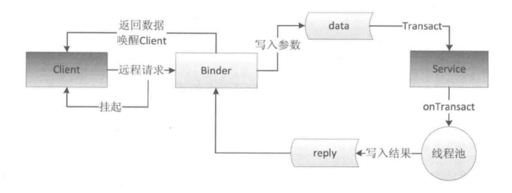

# Android开发艺术探索 笔记

[TOC]


### #1 Activity的生命周期和启动模式

##### 1.1 Activity的生命周期全面分析

- 典型情况下的生命周期分析

  - 生命周期

    - `onCreate()`和`onDestroy()`是配对的
    - `onStart()`和`onStop()`是配对的，熄屏等操作会调用。此时Activity存在（可能可见）但处于后台
    - `onResume()`和`onPause()`是配对的，熄屏等操作会调用
    - `onPause()`和`onStop()`都不应该执行耗时的操作（尤其是前者）
    - 只要是从`onStop()`到`onStart()`，中间一定经过`onRestart()`（不销毁就重启）

  - 打开第二个Activity的生命周期

    ```
    当前activity：activity1
    准备启动activity2
    ------
    Activity1	onPause()
    Activity2	onCraete()>>onStart()>>onResume()
    Activity1	onStop()
    ```

- 异常情况下的生命周期分析

  - 情况1：资源相关的系统配置发生改变导致Activity被杀死重建：例如横屏换竖屏

    - 系统会在`onDestroy()`执行前调用`onSaveInstanceState()`来保存当前Activity的状态
    - 系统会在新Activity调用`onCreate()`后执行`onRestoreInstanceState()`。系统会自动保存当前Activity的视图结构，并在此恢复，如EditText中用户输入的数据，ListView滚动的位置
    - 正常启动时，`onCreate()`传入的bundle为空

  - 情况2：资源内存不足导致低优先级的Activity被杀死

    - 对于Activity，处于后台且不可见的Activity优先级最低，系统会杀死Activity所在进程。杀死后仍通过bundle存储和恢复数据
    - 如果一个进程没有四大组件在运行，则很快被杀死

  - 令Activity屏蔽发生变化的系统配置（不杀死以重新创建）：给Activity指定configChanges属性

    ```groovy
    android:configChanges="orientation|ScreenSize"
    // 屏幕方向
    ```

    - 更多configChanges：p14

##### 1.2 Activity的启动模式

- Activity的LaunchMode④
  - standard：默认
  - singleTop：如果当前Activity已位于栈顶，则此Activity不会被重新创建（不会调用这个Activity的onCreate和onStart），同时它的`onNewIntent()`方法会被调用
  - singleTask：系统首先会寻找是否存在activityA想要的任务栈，如果不存在，则重新创建一个任务栈，然后将activityA加到栈中。如果存在且activityA在栈内，则在activityA上的Activity全部出栈。activityA的`onNewIntent()`方法会被调用
  - singleInstance：具有singleTask模式的所有特性，且此种模式的Activity只能单独地位于一个任务栈中
  - 特殊情况
    - 使用ApplicationContext去启动standard模式的Activity时会报错。解决方法是为待启动的Activity指定标志位FLAG_ACTIVITY_NEW_TASK，此时以singleTask模式启动该Activity
    - 若存在两个任务栈，前台任务栈有ActivityBA（顶》底），后台任务栈有ActivityDC。CD启动模式均为singleTask。当在前台请求启动D时，整个后台任务栈都会加载到前台中。当在前台请求C时，只有C会加载到前台中
- Activity所要的任务栈：与参数TaskAffinity相关，在Manifest中或intent中指定
  - :flags:
- Activity的Flags
  - FLAG_ACTIVITY_NEW_TASK：指定启动模式为singleTask
  - FLAG_ACTIVITY_SINGLE_TOP：指定启动模式为singleTop
  - FLAG_ACTIVITY_CLEAR_TOP：指被启动的Activity在栈中以上的所有Activity都出栈。若启动模式为standard，则该Activity先出栈再重新创建
  - FLAG_ACTIVITY_EXCLUDE_FROM_RECENTS：具有这个标记的Activity不会出现在历史列表中

##### 1.3 IntentFilter的匹配规则

- 需指定action、category和data信息，可以匹配多个。一个activity中也可以有多个intent-filter
- 匹配规则：:flags:


[TOC]

### #2 IPC机制

> Inter-Process Communication进程间通信

- [x] ——Binder前
- [x] ——Binder
- [x] ——AIDL部分
- [x] ——AIDL
- [x] ——2.5前
- [ ] ——#3前

##### 2.1 Android IPC简介

- 进程与线程
  - 线程是CPU调度的最小单元，是一种有限的资源
  - 进程指一个执行单元，在PC和移动设备上指一个程序或app。一个进程可以包括多个线程
  - 任何一个系统都有IPC机制。Android中IPC方式有Binder、Socket等
- 使用多进程的场景
  - 因为某些原因需要运行在单独的进程中
  - 加大应用可使用的内存而使用多进程
  - ContentProvider或者其他直接获取其他应用的数据的方式
- 利用adb shell查看进程
  - `ps -A`
  - 从结果中匹配名字：`ps -A|grep com.***.***`

##### 2.2 Android中的多进程模式

- 开启多进程模式

  - 在Android中使用多进程方法：给四大组件在Manifest中指定`android:process`属性，或在native层fork一个进程

    ```xml
    // :代表了包名。以冒号开头的进程都是私有进程
    android:process=":test2"
    ```

- 多线程的运行机制

  - 多进程会带来许多问题
    - 无法通过内存来共享数据，静态成员和单例模式完全失效（不同进程分配给了不同的虚拟机，所以不同进程访问同一个对象的时候实际访问的是该对象的多个副本之一，副本之间互不干扰）
    - 线程同步机制完全失效（锁的不是同一个对象）
    - SharedPreference的可靠性下降（不支持两个进程同时执行读写操作）
    - App会多次创建（基于独立性）

##### 2.3 IPC基础概念介绍

- Serializable接口和Parcelable接口可以完成对象的序列化过程

- Serializable接口
  - java提供，简单但开销大，需要大量IO操作，存储到设备上或者网络传输也更方便
  - 只需要在类的声明中指定一个id即可自动实现默认的序列化过程（id用于表示类的版本，java会自动生成。手动指定该id可以提高恢复成功率）
  - 经过序列化和反序列化后两者内容一样，但不是同一个对象
  
- Parcelable接口
  - android提供的序列化方式，麻烦但效率高。主要用于内存序列化上
  - 只要实现了这个接口，一个类的对象就可以实现序列化并可以通过Intent和Binder传递
  - CREATOR和private构造器用于反序列化
  - `writeToParcel()`用于序列化
  - `describeContents()`用于内容描述，默认返回0，仅当当前对象中存在文件描述符时返回1
  
- Binder

  - 所有可以在Binder中传输的接口都需要继承IInterface接口

  - transcat过程

    - 当客户端和服务端位于同一个进程下时，方法调用不会走跨进程的transcat过程；反之则需走transcat过程，使用proxy完成
    - 使用了id标识在transcat过程中的客户端所请求的是哪个方法。会自动为每个aidl中声明的方法生成id

  - Binder（Stub和Stub的内部代理类Proxy）的属性与方法

    > Stub就是客户端中假装成服务的客户端helper。Skeleton是服务器端helper

    - DESCRIPTOR：Binder的唯一标识。一般以Binder的包名+类名表示
    - asInterface：将服务端的Binder对象转换为客户端所需要的AIDL接口类型对象。如果客户端和服务端位于同一进程，则返回的是服务端的Stub对象本身，否则返回的是系统封装后的Stub.proxy
    - asBinder：用于返回当前的Binder对象
    - onTransact：此方法运行在服务端中的Binder线程池中。根据方法id处理客户端发起的请求
    - Proxy#（= Proxy下的）getBookList：此方法运行在客户端。根据id执行不同的操作

  - Binder工作机制

    

    - 当客户端发起请求时，当前线程将会挂起直到服务端进程返回数据
    - 服务端的Binder应该采用同步的方式实现，因为已经存在于线程池中
    - linkToDeath与unlinkToDeath：因为服务器端有可能由于某种原因而异常终结，设置死亡代理以防止客户端不知道服务器端暴毙的情况

##### 2.4 Android中的IPC方式

- 使用Bundle：在Bundle中添加数据并使用Intent发送，在四大组件间通信，对数据类型有限制
- 使用文件共享
  - 对文件格式无限制，但是难免避开并发性的问题。适用于对同步要求不高的进程之间通信
  - SharedPreference也属于文件的一种，但由于系统对其读写有一定的缓存策略，因此在多进程模式下，系统对它的读写并不可靠，面对高并发读写访问时，有很大几率会丢失数据
- 使用Messenger

  - 可以在不同进程之间传递Message对象。本质是AIDL
  - 只能一个个处理，只能传输Bundle支持的数据类型
  - :flags: 
- 使用AIDL：
  - 服务端：创建Service用来监听客户端的连接请求、创建一个AIDL文件用于暴露接口、在Service中实现这些接口
  - 客户端：绑定Service并将其返回的Binder还原、调用AIDL提供的方法
  - AIDL接口的创建
  - :flags: 实践部分
- 使用ContentProvider
  - 数据源访问方面功能强大，支持一对多并发数据共享。Binder是其底层实现
  - 将ContentProvider放在独立进程中时，Provider以及访问这个Provider的组件需要声明权限
  - `onCreate()`方法仍会在主线程中执行，其余方法则在单独的线程中执行

- 使用Socket套接字
  - 功能强大，但实现略麻烦
  - 分为流式套接字和用户数据套接字，分别用于TCP和UDP协议

##### 2.5 Binder连接池

> 痛点：假若要实现100个AIDL接口，总不能创建100个Service，因为Service是一种系统资源。所以要将所有的AIDL放在同一个Service中去管理

- 在同一个Service下实现多个AIDL接口
  - 服务端提供一个queryBinder接口，这个接口能够根据业务模块的特征来返回相应的Binder对象，不同的业务模块拿到所需的Binder对象后就可以进行远程方法调用了

##### ex2.3 初次使用多进程

- 创建AIDL文件

  - 右键创建aidl文件，编写代码完成后执行assembleDebug。执行后生成了对应(同名)的Binder接口，位于generated目录下
  - 如果AIDL文件使用到了自定义的Parcelable对象，那么必须新建一个和它同名的AIDL文件，并在其中声明为Parcelable类型

  ```java
  // IBookManager.aidl
  package com.example.myaidl;
  import com.example.myaidl.Book;
  
  interface IBookManager{
      List<Book> getBookList();
      void addBook(in Book book);
  }
  ```

  ```java
  // Book.java
  public class Book implements Parcelable{...}
  ```

  ```java
  // Book.aidl
  package com.example.myaidl;
  parcelable Book;
  ```

- Service中构建Binder对象

  - CopyOnWriteArrayList支持并发读写的List
  - 与基础篇的Binder构建不同，此处的Binder类由AIDL产生的类提供
  - 声明进程

  ```xml
  <service android:name=".BookManagerService"
      		 android:process=":remote"/>
  ```

  ```java
  // BookManagerService.java
  private CopyOnWriteArrayList<Book> mBooklist = new CopyOnWriteArrayList<>();
  
  private Binder mBinder = new IBookManager.Stub() {
      @Override
      public List<Book> getBookList() throws RemoteException {
          return mBooklist;
      }
  
      @Override
      public void addBook(Book book) throws RemoteException {
          mBooklist.add(book);
      }
  };
  
  @Override
  public void onCreate() {
      super.onCreate();
      mBooklist.add(new Book("十万个为什么",0));
      mBooklist.add(new Book("吸血鬼的故事",1));
  }
  
  @Override
  public IBinder onBind(Intent intent) {
      return mBinder;
  }
  ```

- Activity中连接：和基础篇绑定Binder一样，使用ServiceConnection

  ```java
  private ServiceConnection mConnection = new ServiceConnection() {
      @Override
      public void onServiceConnected(ComponentName name, IBinder service) {
          IBookManager bookManager = IBookManager.Stub.asInterface(service);
          try {
              List<Book> list = bookManager.getBookList();
              Log.i(TAG, "query book list, list type: "+list.getClass().getCanonicalName());
              Log.i(TAG, "query book list: "+list.toString());
          }catch (RemoteException e){
              e.printStackTrace();
          }
      }
  
      @Override
      public void onServiceDisconnected(ComponentName name) {
  
      }
  };
  ```

  ```java
  Intent intent = new Intent(this, BookManagerService.class);
  bindService(intent, mConnection, Context.BIND_AUTO_CREATE);
  ```

##### ex#2.3-2 完善IPC通信细节

- :flags: 链接p92+

##### ex#2.4 Socket通信

- :flags:链接p119+

##### ex#2.6 AIDL

- :flags:链接p128+


[TOC]

### #3 View的事件体系

##### 3.1 View的基础知识

- View的位置参数：由四个顶点来决定

  - top, left, right, bottom皆为其到屏幕左侧或屏幕顶部的距离
  - x, y：左上角的坐标
  - translationX, translationY是View左上角相对于父容器的偏移量。有如下参数关系：y = top + translationY

- MotionEvent和TouchSlop

  - 典型的MotionEvent

    - ACTION_DOWN：下手接触
    - ACTION_MOVE：手指在移动
    - ACTION_UP：手松开

  - 可以通过MotionEvent对象获取点击事件发生的x和y坐标

    - getX/getY：返回相对于当前View的左上角x和y坐标
    - getRawX/getRawY：返回相对于手机屏幕左上角的x和y坐标

  - TouchSlop是常量，滑动之间的距离小于该范围是，系统不认为这是个滑动操作

    - 获取(Java中)

    ```java
    ViewConfiguration.get(getContext()) .getScaledTouchSlop()
    ```

    - 获取(源码中)：frameworks/base/core/res/res/values/config.xml文件中，config_viewConfigurationTouchSlop标签内

- VelocityTracker

  - 速度追踪

- GestureDetector

  - 手势检测

- Scroller

  - 用于实现View的弹性滑动


##### 3.2 View的滑动（平移？）

> 以下是三种实现滑动的方式

- 使用View本身提供的scrollTo或scrollBy
- 使用动画添加效果
- 改变布局参数使得重新布局
- 各种滑动方式的对比
  - scrollTo/scrollBy：方便且不影响内部元素的点击事件，但是只能滑动View的内容，不能滑动View本身
  - 动画：可以实现复杂的效果
  - 改变布局：使用麻烦，但适用于有交互的View


##### 3.3 弹性滑动（有动画的滑动？）

- Scroller的使用及其工作原理
- 通过动画Handler
- 使用延时策略

##### 3.4 View的事件方法机制

- 点击事件的分发规则：分发过程由三个重要的方法共同完成

  - dispatchTouchEvent(MotionEvent ev)
  - onInterceptTouchEvent(MotionEvent ev)
  - onTouchEvent(MotionEvent ev)

  - 三个方法之间的关系（伪代码）

- 事件分发的源码解析

  - Activity对点击事件的分发过程
  - Window对事件的分发过程
  - 顶级View对点击事件的分发过程
  - View对点击事件的处理过程


##### 3.5 View的滑动冲突

- 常见的滑动冲突场景
  - 外部左右可滑动，内部上下可滑动
  - 外部上下可滑动，内部上下可滑动
  - 外部左右可滑动，内部左右可滑动，内部2上下可滑动

- 滑动冲突的处理规则
- 滑动冲突的解决方式
  - 外部拦截法：点击事件都先经过父容器的拦截处理，如果父容器需要此事件就拦截，如果不需要就不拦截。这种方法符合安卓中的事件分发机制
  - 内部拦截法：父容器不拦截任何事件，所有的事件都传递给子元素，如果子元素需要就直接消耗掉，否则就交由父容器进行处理。这种方法较复杂，需要配合requestDisallowInterceptTouchEvent方法完成


##### ex3.2：跟手滑动效果

##### ex3.5：滑动冲突解决两种方法的示例 p176


[TOC]

### #4 View的工作原理

##### 4.1 初始ViewRoot和DecorView

- ViewRoot
  - 用于连接WindowManager和DecorView的纽带
  - View的三大流程都是由ViewRoot完成的，是从ViewRoot的performTraversals方法开始的
- DecorView
  - 顶级View，是一个FrameLayout
  - 一般情况下内部包括了一个竖直方向的LinearLayout，包含了两部分：titlebar和android.R.id.content，后者由`setContentView()`指定布局

##### 4.2 理解MeasureSpec

- MeasureSpec和父容器决定了一个View的尺寸规格
- MeasureSpec
  - 代表一个32位的int值
    - 高两位代表SpecMode
    - 低30位代表SpecSize
    - 通过将两者打包成一个int值来避免过多的对象内存分配
  - SpecMode
    - UNSPECIFIED：父容器不对View有任何限制，要多大给多大。一般用于系统内部
    - EXACTLY：父容器已经检测出View所需的精确大小，这个时候View的最终大小是SpecSize所指定的值，对应于LayoutParams中的match_parent和具体数值两种形式
    - AT_MOST：父容器指定了一个可用大小即SpecSize，View的大小不能大于这个值。对应于LayoutParams中的wrap_content
- MeasureSpec和LayoutParams的对应关系
  - 可以给View设置LayoutParams。LayoutParams和父容器共同决定MeasureSpec
    - DecorView的MeasureSpec由窗口的尺寸和LayoutParams共同决定

  - 在View测量的时候，系统会将LayoutParams在父容器的约束下转换成对应的MeasureSpec


##### 4.3 View的工作流程(三大流程)

- measure过程：决定宽高
  - View只需调用此方法即可完成测量过程
  - ViewGroup除了完成测量过程，还需要遍历调用所有子View的measure方法
  - 只有测量过程完成后，才能得到View的正确宽高，否则返回0

- layout过程：确定位置
  - 当ViewGroup的位置被确定后，在onLayout中遍历所有子元素并调用其layout方法

- draw过程：绘制到屏幕上
  - 遵循如下步骤
    - 绘制背景background.draw(canvas)
    - 绘制自己onDraw()
    - 绘制childrendispatchDraw()
    - 绘制装饰onDrawScrollBars()


##### 4.4 自定义View

- 自定义View的分类及示例
  - 继承View重写onDraw
  - 继承ViewGroup派生特殊的Layout
  - 继承特定的View（如TextView）
  - 继承特定的ViewGroup（如LinearLayout）

- 自定义View注意事项
  - 让View支持wrap_content
  - 如果有必要，让View支持padding
  - 尽量不要在View中使用Handler，没必要
  - View中如果有线程或者动画，需要及时停止，参考View#onDetachedFromWindow
  - View带有滑动嵌套情形时，需要处理好滑动冲突

- 自定义View的思想

##### ex4-4 自定义View示例

- p217 :flags:


[TOC]

### #5 理解RemoteViews

- RemoteView提供了跨进程更新界面的操作

##### 5.1 RemoteViews的应用

- 通知栏上

- 桌面widget上

  - 定义widget界面
  - 定义widget配置信息
  - 定义AppWidgetProvider的子类
  - 在Manifest中声明

- AppWidgetProvider：本质是广播

  - onUpdate()
  - onEnabled()
  - onDisabled()
  - onDeleted()
  - onReceive()

- PendingIntent：

  > 处于pending状态下的intent。pending表示待定、即将发生的意思

  - 支持三种特定意图：启动Activity、启动Service、发送广播

##### 5.2 RemoteViews的内部机制

- RemoteViews的限制
  - 仅支持部分View类型，且不包括其子类
  - 不提供findViewById()方法，只能用一系列set方法完成

##### 5.3 RemoteViews的意义

##### ex5-3 实现广播RemoteView


[TOC]

### #6 Android的Drawable

- 自定义成本比View要低，占用空间较小

##### 6.1 Drawable简介

- 每个具体的Drawable都有其子类，如ShapeDrawable、BitmapDrawable等
- 内部宽、高的获取：getIntrinsicWidth/Height
  - 不是所有的Drawable都有内部宽高，颜色Drawable就没有

##### 6.2 Drawable的分类

- BitmapDrawable：可以直接引用原始图片，也可以通过XML方式来描述。后者能设置效果

  ```
  android:src=“@[package:]drawable/img”
  android:antialias		// 抗锯齿
  android:dither			// 抖动效果：可以让高质量图片在低质量屏幕上有不错的显示效果
  android:filter			// 图片被拉伸时保存较好的显示效果
  android:mipMap			// 纹理映射
  android:tileMode		// 平铺模式。开启后，忽略gravity属性
  android:gravity			// 位置
  ```

- ShapeDrawable：有四种图形》rectangle、oval、line、ring

  - ring有5个特殊的属性：innerRadius圆环内半径, thickness厚度, innerRadiusRatio内半径占比, thicknessRatio后读占比, useLevel一般为false

- LayerDrawable

  - 对应于\<layer-list>标签
  - 通过将不同Drawable放在不同的层上面从而达到叠加后的效果

- StateListDrawable

  - 对应于\<selector>标签
  - 表示Drawable的集合，每个Drawable都对应折View的一种状态

- LevelListDrawable

  - 对应于\<level-list>标签
  - 根据不同level，切换至对应的Drawable

- TransitionDrawable

  - 对应于\<transition>标签
  - 表示Drawable之间淡入淡出的效果

- InsetDrawable

  - 对应于\<inset>标签
  - 将其他Drawable内嵌到自己当中，并可以在四周留出一定的间距。通过LayerDrawable也可以实现这种效果

- ScaleDrawable

  - 对应于\<scale>标签
  - 根据level指定Drawable缩放到一定比例

- ClipDrawable

  - 对应于\<clip>标签
  - 根据当前level来裁剪Drawable


##### 6.3 自定义Drawable

- 核心就是draw()，通过重写该方法实现自定义。自定义的Drawable无法在XML中使用

##### ex6-3 自定义Drawable

- p278 :flags:


[TOC]

### #7 Android动画深入分析

##### 7.1 View动画

- View动画的种类
  - 四种变换效果对应着Animation的四个子类：TranslateAnimation、SacleAnimation、RotateAnimation、AlphaAnimation
  - 创建动画：通过res/anim/filename.xml来定义（根元素为set），或者使用代码来动态创建
    - android:interpolator：表示动画集合所采用的插值器，插值器影响动画的速度。非匀速动画就需要通过插值器来控制动画的播放过程
    - android:shareInterpolator：表示集合中的动画是否共享同一个插值器

- 自定义View动画
  - 继承自Animation，并重写
    - initialize()：初始化
    - applyTransformation()：进行相应的矩阵变换。可采用Camera

- 帧动画
  - 使用XML来定义一个AnimationDrawable，然后将其作为View的背景并通过Drawable来播放
  - 使用简单，但容易引起OOM


##### 7.2 View动画的特殊使用场景

- LayoutAnimation
  - 作用于ViewGroup的动画效果。当其子元素出场时皆会带有这种动画效果
  - 使用XML定义LayoutAnimation
    - android:delay：表示子元素开始动画的时间延迟
    - android:animationOrder：有三种顺序：normal、reverse（排在后面的优先放动画）、random
    - android:animation：为子元素指定定义动画
  - 在layout布局文件中，通过指定android:layoutAnimation设置动画
  - 也可以使用LayoutAnimationController来指定
- Activity的切换效果
  - 使用overridePendingTransition来指定动画
    - 这个方法必须在startActivity()或者finish()之后被调用才能生效


##### 7.3 属性动画

> API 11+  (3.0+)

- 常用动画类包括了ValueAnimator（xml中标签为`animator`）、ObjectAnimator和AnimatorSet等
- 使用属性动画
  - 通过代码指定或在res/animator/下的xml文件中定义

- 理解插值器TimeInterpolator和估值器TypeEvaluator
  - 两者是实现非线性动画的关键，其中前者决定动画速度属性，后者计算动画某一时刻下的动画属性

- 属性动画的监听器
  - AnimatorListener用于监听动画播放的关键过程：可以监听其开始、结束、取消以及重复播放
  - AnimatorUpdateListener用于监听折动画过程，没播放一帧，就调用该方法一次

- 对任意属性做动画
- 属性动画的工作原理
  - 属性动画要求动画作用的对象提供该属性的set方法


##### 7.4 使用动画的注意事项

- 内存泄漏：无限循环动画在Activity退出时应该要及时停止，仅属性动画存在此问题
- View动画的问题：View动画只是对View的影像做动画，不会改变View的状态。有时会导致动画完成后View无法隐藏的现象，需要先调用view.clearAnimation()清除动画


[TOC]

### #8 理解Window和WindowManager

- Window表示一个窗口的概念，是一个抽象类，具体实现是PhoneWindow
- 使用WindowManager创建一个Window。Window的具体实现位于WindowManagerService中。Window Manager和WindowManagerService的交互是一个IPC过程
- Android中所有的视图都是通过Window来呈现的，包括了Activity、Dialog和Toast
  - 点击事件是Window传递给DecorView再传递给View的
  - setContentView在底层也是通过Window来完成
- 每个Window都对应着一个View和一个ViewRootImpl

##### 8.1 Window和WindowManager

- Window属性
  - Flags参数
    - FLAG_NOT_FOCUSABLE：表示Window不需要获取焦点
    - FLAG_NOT_TOUCH_MODAL：此模式下，系统会将当前Window区域以外的单击事件传递给底层的Window，当前Window区域以内的单击事件则自己处理
    - FLAG_SHOW_WHEN_LOCKED：可以让Window显示在锁屏界面上

  - Type参数
    - 应用Window：对于这一个Activity
    - 子Window：需要附属在特定的父Window之中，如Dialog
    - 系统Window：需要声明权限才能够创建的Window，如系统状态栏和Toast

  - z-ordered：层级范围

- 只能通过WindowManager来访问Window
- Window Manager常用的三个方法
  - addView()添加
  - updateViewLayout()更新
  - removeView()移除


##### 8.2 Window的内部机制

- Window的添加过程
- Window的删除过程
- Window的更新过程

##### 8.3 Window的创建过程

- Activity的Window创建过程
  - setContentView步骤
    - 如果没有DecorView，则创建
    - 将View添加到DecorView的mContentParent
    - 回调Activity的onContentChanged()通知Activity视图已经发生变化

- Dialog的Window创建过程
  - 创建Window
  - 初始化DecorView并将Dialog的视图添加到DecorView中
  - 将DecorView添加到Window中显示

- Toast的Window创建过程


[TOC]

### #9 四大组件的工作过程

##### 9.1 四大组件的运行状态

- 四大组件
  - 需要在Manifest中注册，除了动态的BroadcastReceiver
  - 需要借助Intent启动，除了ContentProvider
- Activity：只有启动状态
- Service：有启动状态和绑定状态，前者执行后台计算，后者与外界通信方便。两者可共存
- BroadcastReceiver：不适合执行耗时操作
- ContentProvider：内部的增删改查需处理好线程同步

##### 9.2 Activity的工作过程

##### 9.3 Service的工作过程

- Service的启动过程
- Service的绑定过程

##### 9.4 BroadcastReceiver的工作过程

- 广播的注册过程
  - 静态注册的广播在应用安装时自动完成注册，通过PackageManagerService完成
  - 动态注册的广播：从ContextWrapper的registerReceiver开始

- 广播的发送和接受过程
  - 普通广播、有序广播、粘性广播


##### 9.5 ContentProvider的工作过程

- ContentProvider的onCreate()要先于Application的onCreate()


### #10 Android的消息机制

- 主要是指Handler运行机制。Handler运行需要底层的MessageQueue和Looper支撑，前者使用单链表的数据结构存储，后者以无限循环的形式去查找是否有新消息
  - Looper有一个特殊的概念：ThreadLocal
    - 用于在每个线程中互不干扰地存储并提供数据
    - 通过ThreadLocal可以获取每个线程中的Looper
  - 线程默认是没有Looper的，而ActivityThread在被创建时就会初始化Looper

##### 10.1 Android的消息机制概述

- Handler主要作用是将一个任务切换到某个指定的线程中去执行

##### 10.2 Android的消息机制分析

- ThreadLocal的工作原理

##### 10.3 主线程的消息循环


### #11 Android的线程和线程池

##### 11.1 主线程和子线程

##### 11.2 Android中的线程形态

- AsyncTask
- AsyncTask的工作原理
- HandlerThread
- IntentService

##### 11.3 Android中的线程池

- ThreadPoolExecutor
- 线程池的分类


### #12 Bitmap的加载和Cache

##### 12.1 Bitmap的高效加载

##### 12.2 Android中的缓存策略

- LruCache
- DiskLruCache
- ImageLoader的实现

##### 12.3 ImageLoader的使用

- 照片墙效果
- 优化列表的卡顿现象


### #13 综合技术

##### 13.1 使用CrashHandler来获取应用的crash信息

##### 13.2 使用multidex来解决方法数越界

##### 13.3 Android的动态加载技术

##### 13.4 反编译初步

- 使用dex2jar和jd-gui反编译apk
- 使用apktool对apk进行二次打包


### #14 JNI和NDK编程

##### 14.1 JNI的开发流程

##### 14.2 NDK的开发流程

##### 14.3 JNI的数据类型和类型签名

##### 14.4 JNI调用Java方法的流程


### #15 Android性能优化

##### 15.1 Android的性能优化方法

- 布局优化
- 绘制优化
- 内存泄漏优化
- 响应速度优化和ANR日志分析
- ListView和Bitmap优化
- 线程优化
- 一些性能优化建议

##### 15.2 内存泄漏分析之MAT工具

##### 15.3 提高程序的可维护性