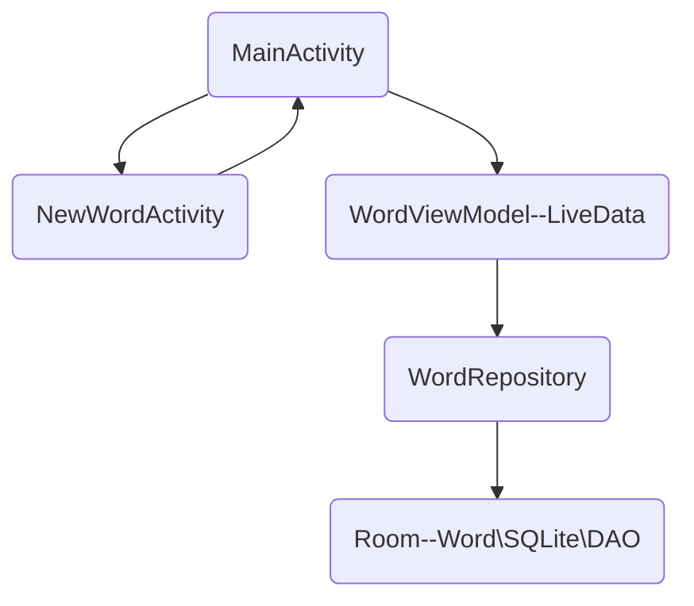

[TOC]

# 存储数据

## SharePreference

https://developer.android.google.cn/training/data-storage/shared-preferences

##### 写入

- 通过使用 `putInt()` 和 `putString()` 等方法写入的键和值。然后，调用 `apply()` 或 `commit()` 以保存更改
  - apply：立即更改内存中的SharedPreferences对象，会将更新异步写入磁盘
  - commit：是同步的，应避免从主线程调用它

```java
SharedPreferences sp = getActivity()
  .getPreferences(Context.MODE_PRIVATE);
SharedPreferences.Editor editor = sharedPref.edit();
editor.putInt(getString(R.string.saved_high_score_key)
  , newHighScore);
editor.commit();
```

##### 获取

- 调用 `getInt()` 和 `getString()` 等方法，为您想要的值提供键；如果键不存在，则可以选择返回默认值

```java
SharedPreferences sp = getActivity()
  .getPreferences(Context.MODE_PRIVATE);
int defaultValue = getResources()
  .getInteger(R.integer.saved_high_score_default_key);
int highScore = sharedPref
  .getInt(getString(R.string.saved_high_score_key), defaultValue);
    
```


[TOC]

## SQLite

[官方文档]: https://developer.android.google.cn/training/data-storage/sqlite


##### 数据库使用准备工作：contract

- 创建一个类使用BaseColumns接口（使用与否重要性不大）

  `implements BaseColumn{}`

- 把表名、及列名存储到该类中的名为TABLE_NAME、COLUMN_GUEST等的String类型中以便后续使用

- 无需添加id，因为BaseColumn自带

```java
public class TodoContract {
    private TodoContract() {}

    public class TodoEntry implements BaseColumns {
        public static final String TABLE_NAME = "TODO";
        public static final String COLUMN_ITEM = "ITEM";
        public static final String COLUMN_STATUS = "STATUS";
        public static final int categoryNormal = 0;
        public static final int categoryUrgent = 1;
        public static final int categoryCold = 2;
    }
}
```


##### 使用SQLiteOpenHelper来连接

- 创建一个类`TodoDbOpenHelper`继承SQLiteOpenHelper

  `extends SQLiteOpenHelper{}`

- 重写onCreate方法：第一次创建表格

  - 把执行的SQL语句用字符串连接的方法（+）写入一个新的字符串中

    - 要注意留空格
    
    `sqLiteDatabase.execSQL(SQL语句字符串类型)`

- 重写onUpgrade方法：确保更新

  - 使用.execSQL方法删除表格
  - 再调用onCreate（）

- 类中存储（public）

  - 版本号（int）
  - 数据库全称`string DATABASE_NAME = "todo.db"`

- 构造器

  - 调用父类构造器、填入自己创建的数据库名称及版本号

    `super(context, DATABASE_NAME, null, DATABASE_VERSION);`
    
  - 构造器应该只接受context（目前为止）
  
- 使用数据库时应该调用

  - 声明SQLDatabase变量
  - 实例化一个（继承了SQLiteOpenHelper的那个）类。
  - 调用其`.getWritableDatabase()`或`.getReadableDataBase()`并赋值给SQLDataBase变量


##### 检索数据

- 使用Cursor类读取数据
  - 将SQLDataBase变量的`.query(String table,String[] columns,String selection,String[] selectionArgs,String groupBy,String having,String orderBy)`方法的值赋予给Cursor类的实例
  - 若无对应参数，则填入`null`
  - `.getCount()`方法可获取cursor读取到的数量


##### 将数据显示出来

- 在mainActivity中实例化一个继承了`RecyclerView.Adapter<GreenHolder>`的类`(mAdapter)`

- 将数据放入到RecyclerView（Adapter）

  - 在类`(mAdapter)`中声明一个Cursor类型变量
  - 更改构造器参数，使其获得一个Cursor类型变量并存储到上述变量中
  - 修改mainActivity的参数传入
  - 在重写的`getItemCount()`方法中返回Cursor的`.getCount()`方法

- 绑定写入值的View

  - `(mAdapter)`类中构建一个类`(GuessViewHolder)`继承自`RecyclerView.ViewHolder`

  - 在该类中构造器利用`findViweById(int id)`绑定

  - 重写`(mAdapter)`的`onCreateViewHolder`并返回一个`(GuessViewHolder)`

    ```
    LayoutInflater inflater = LayoutInflater.from(mContext);
    View view = inflater.inflate(R.layout.guest_list_item, parent, false);
    return new GuestViewHolder(view);
    ```

- 利用`onBindViewHolder`把值写到view中

  - 先判断查找的位置是否在边界内

    `if(!mCursor.moveToPosition(position))return;`

  - 使用contract的存储名获取表格具体值

    `String name = mCursor.getString(mCursor.getColumnIndex(WaitlistContract.WaitlistEntry.COLUMN_GUEST_NAME));`

    - 数字应该使用`getInt()`
  - ID应该使用`getLong()`
  
  - 将id写入itemView的tag中中（这是recyclerView自带的）
  
    `holder.itemView.setTag(id)`
  
  - 使用`holder.(TextView).setText()`写到界面中


##### 添加到数据库中

- 在获取数据前检查获取的文本是否为空

- 将一行的数据传入到ContentValues的实例中

  - `.put(String ColumnName,String(int) value)`

- 将ContentValues的实例插入到数据库变量`(mDb)`

  `.insert(String TABLE,null,ContentValues cv)`

  - id、timestamp都会自动插入，这是`onCreate`方法创建时声明的

- 增加完后，要为cursor辞旧迎新

  - 如果旧cursor非空，则关闭

    `if(mCursor!=null)mCursor.close();`

  - 替换并调用notifyDataChanged()

    `mCursor = newCursor;
    if(newCursor != null)this.notifyDataSetChanged();`
  
- 在mainActivity中如此调用
  
    `mAdapter.swapCursor(查询时返回cursor的那个函数())`


##### 删除数据库元素

- 在数据库变量中调用

  `.delete(String TABLE,String 删除语句,null)`
  
  - 此函数会返回删除了的行数


##### 左右划动时删除

- 在`onCreate`中创建一个`ItemTouchHelper`、填入参数、填入对应的RecyclerView

  ```
  new ItemTouchHelper(new ItemTouchHelper.SimpleCallback(0, ItemTouchHelper.LEFT | ItemTouchHelper.RIGHT) {……}).attachToRecyclerView(对应的RecyclerView);
  ```

- 重写`onMove`：不需要此处直接return false

- 重写`onSwiped`：

  - 获取相应id

    `= (long)viewHolder.itemView.getTag()`

  - 调用删除（where语句中指定该id）

  - 更新adapter


[TOC]

## Room

- 三个组件

  - 数据库
  - Entity：表示数据库中的表
  - DAO(Data Access Object)：数据访问对象

  ```mermaid
  graph LR
    	id1(DataBase)--get DAO-->id2[Rest of the app]
    	id3[DAO]--Get Entities from db-->id2
    	id4[Entities]--get/set field values-->id2
    	id2-->id1
    	id2-->id3
    	id2-->id4
    	
    	
  
  ```

##### #1 更新gradle文件

```
// Room components
implementation "androidx.room:room-runtime:$rootProject.roomVersion"
annotationProcessor "androidx.room:room-compiler:$rootProject.roomVersion"
androidTestImplementation "androidx.room:room-testing:$rootProject.roomVersion"

// Lifecycle components
implementation "androidx.lifecycle:lifecycle-extensions:$rootProject.archLifecycleVersion"
annotationProcessor "androidx.lifecycle:lifecycle-compiler:$rootProject.archLifecycleVersion"
```

- 版本号需要自己搜，并在另一个gradle中（project）的根部输入

```
ext {
    roomVersion = '2.1.0-alpha06'
    archLifecycleVersion = '2.0.0'
}
```

##### #2 创建实体

- 新建一个类`(Word)`来表示这个实体

- 它可以有构造器，提供 getter 和 setter

  - 实体可以具有空的构造函数（如果相应的 [DAO](https://developer.android.google.cn/training/data-storage/room/accessing-data?hl=zh_cn) 类可以访问保留的每个字段），也可以具有其参数包含的类型和名称与该实体中字段的类型和名称匹配的构造函数。Room 还可以使用完整或部分构造函数，例如仅接收部分字段的构造函

- 在该类中，把成员变量当作每一列的列名

- 使用注释，使得Room获得信息：

  - `@Entity`表示这是一个实体。

    - 这是必须的添加到class之上的
    - `@Entity(tableName = "word_table")`当表名与类名不同时，才需要按照括号内的写法编写代码。**如果用的是Java，这是必须的用法**
    - SQLite 中的表名称不区分大小写

  - `@PrimaryKey`表示主键

    - 每个实体必须将至少 1 个字段定义为主键，即使只有 1 个字段

    - 如果您想让 Room 为实体分配自动 ID，则可以设置 `@PrimaryKey` 的 [`autoGenerate`](https://developer.android.google.cn/reference/androidx/room/PrimaryKey?hl=zh_cn#autoGenerate()) 属性

      `@PrimaryKey(autoGenerate = true)`

    - 如果实体具有复合主键，您可以使用 [`@Entity`](https://developer.android.google.cn/reference/androidx/room/Entity?hl=zh_cn) 注释的 [`primaryKeys`](https://developer.android.google.cn/reference/androidx/room/Entity?hl=zh_cn#primaryKeys()) 属性

  - `@NonNull`表示参数永不为空

  - `@ColumnInfo(name = "word")`列名称

    - 仅当名称与成员变量不同时所用到，默认命名则不需要添加注释。**如果用的是Java，这是必须的用法**

  - `@Ignore`用于告诉Room忽略这些被标注的字段

##### #3 创建DAO

> 默认情况下，所有查询必须在单独的线程上执行

- 创建一个新接口并调用它`WordDao`,并以`@Dao`对该类进行注释

  `public interface WordDao{}`

- 用注释方法`@Insert`声明插入一个单词

  `void insert(Word word);`

  - 您不必提供任何SQL！（还有`@Delete`和`@Update`注释，用于删除和更新行，但您未在此应用中使用它们。）

- 声明一种删除所有单词的方法：`void deleteAll();`，由于没有用于删除多个实体的便捷注释，因此为该方法注释`@Query`，并将SQL查询作为字符串参数提供给`@Query`。
  **`@Query("DELETE FROM word_table")`**

  - 使用`@Query`用于读取和复杂查询和提供SQL。

- 创建一种获取所有单词的方法`getAllWords();`，它将返回`List`的`Words`
  **`List<Word> getAllWords();`**

  - 使用SQL查询注释方法：
    `@Query(`**`"SELECT * from word_table ORDER BY word ASC"`**`)`

##### #4 使用LiveData类

> 用于观察数据是否发生变化的生命周期库类，必须配合Room使用

- 在(`WordDao`)，更改`getAllWords()`方法，以便返回的`List<Word>`内容包含`LiveData`。

  `LiveData<List<Word>> getAllWords()`

##### #5 添加Room数据库

> - 是SQLite之上的数据库层，可以代替SQLiteOpenHelper。
>
> - 为避免UI性能下降，Room不允许您在主线程上发出数据库查询
> - Room类必须是抽象类

- 创建一个抽象类（RoomDataBase），继承自`RoomDatabase`，*不需要自动插入方法而是选择使其抽象化*，将该类注释为Room数据库

- 为每个@Dao提供一个抽象的“ getter”方法

  ```Java
  @Database(entities = {Word.class}, version = 1)
  public abstract class WordRoomDatabase extends RoomDatabase {
     public abstract WordDao wordDao();
  }
  ```

- 设置`WordRoomDatabase`一个单例，以防止同时打开多个数据库实例

  ```java
  private static volatile WordRoomDatabase INSTANCE;
  
  static WordRoomDatabase getDatabase(final Context context) {
      if (INSTANCE == null) {
          synchronized (WordRoomDatabase.class) {
             if (INSTANCE == null) {
                      // Create database here
             }
          }
      }
      return INSTANCE;
  }
  ```

- 添加代码以获取数据库（在上面的注释行下）

  ```java
  INSTANCE = Room.databaseBuilder(context.getApplicationContext(),
         WordRoomDatabase.class, "word_database")
         .build();
  ```

##### #6 创建repository

> 抽象了对多个数据源的访问

- 创建一个公共类(WordRepository)，并为DAO和单词列表添加成员变量

  ```java
  private WordDao mWordDao;
  private LiveData<List<Word>> mAllWords;
  ```

- 添加一个获取数据库句柄并初始化成员变量的构造函数

  ```
  WordRepository(Application application) {
      WordRoomDatabase db = WordRoomDatabase.getDatabase(application);
      mWordDao = db.wordDao();
      mAllWords = mWordDao.getAllWords();
  }
  ```

- get方法：返回单词列表

- 插入新单词方法insert。必须在非主线程（UI线程）上执行

  ```Java
  public void insert (Word word) {
      new insertAsyncTask(mWordDao).execute(word);
  }
  ```

  ```java
  private static class insertAsyncTask extends AsyncTask<Word, Void, Void> {
  
      private WordDao mAsyncTaskDao;
  
      insertAsyncTask(WordDao dao) {
          mAsyncTaskDao = dao;
      }
  
      @Override
      protected Void doInBackground(final Word... params) {
          mAsyncTaskDao.insert(params[0]);
          return null;
      }
  }
  ```

  

##### #7 创建ViewModel

> ViewModel所做的是为ui和数据之间提供交流，或者是在不同的fragment之间共享数据。是lifecycle库的一部分（能防止因横屏所导致的重复调用）

- 创建一个类(WordViewModel)，使其继承自`AndroidViewModel`，增加`WordRepository`类型的成员变量以及单词列表，并增加一个构造器，使得livemodel能获得一个`repository`以及`repository`中的单词列表

```java
super(application);
        mRepository = new WordRepository(application);
        mAllWords = mRepository.getAllWords();
```

- getter方法：返回单词列表
- 插入新单词方法insert，它将会调用`repository`的insert方法

##### #8 添加xml布局

- 自定义使用样式表单`values/styles.xml`

```xml
<style name = "mTitle">
		<item name ="android:layout_width">24dp</item>
  ...
</style>
```

- 在布局文件中的view可以直接使用上面这种style

  `style="@style/mTitle"`

- 更换图标

  - 新建一个`Vector Asset`，选择需要的图标
  - 使用代码`android:src"..."`

##### #9 添加RecyclerView

- 创建adapter类继承自 `RecyclerView.Adapter`
- 在mainactivity中调用`RecyclerView`的`setAdapter(Adapter adapter)`以及`setLayoutManager(new LinearLayoutManager(this))`

##### #10 填充数据库

> 每次打开数据库时清空后重新加入

- 在类`WordRoomDatabase`中，新建一个回调函数`RoomDatabase.Callback`

  ```java
  private static RoomDatabase.Callback sRoomDatabaseCallback = 
      new RoomDatabase.Callback(){
  
      @Override
      public void onOpen (@NonNull SupportSQLiteDatabase db){
          super.onOpen(db);
         new PopulateDbAsync(INSTANCE).execute();
     }
  };
  ```

- 因为对Room数据库操作不能出现在主线程上，所以需要创建一个`AsyncTask`

  > 该代码删除数据库的内容，然后用两个单词“ Hello”和“ World”填充数据库。随时添加更多单词

  ```java
  private static class PopulateDbAsync extends AsyncTask<Void, Void, Void> {
  
     private final WordDao mDao;
  
     PopulateDbAsync(WordRoomDatabase db) {
         mDao = db.wordDao();
     }
  
     @Override
     protected Void doInBackground(final Void... params) {
         mDao.deleteAll();
         Word word = new Word("Hello");
         mDao.insert(word);
         word = new Word("World");
         mDao.insert(word);
         return null;
     }
  }
  ```

- 最后将回调添加到数据库构建序列中`.build()`

  `.addCallback(sRoomDatabaseCallback)`

##### #11 添加一个新的activity用于添加数据

- 增加点击事件

  `button.setOnClickListener(new View.OnClickListener(){});`

##### #12 连接数据

1. 在`MainActivity`中, 为`ViewModel`创建一个成员变量

2. 在`onCreate()`中使用`ViewModelProviders` 来连接`ViewModel`和ui

   - 第一次打开这个app时，`Provider`会创建一个`ViewModel`。当这个activity被销毁时，这个`ViewModel`得到保存并会在下一次activity被重新创建时重新出现

   - 通过`ViewModelProviders`获取并保存`ViewModel`

     `= ViewModelProviders.of(this).get(你的ViewModel.class)`

3. 在`onCreate()`中为`ViewModel`下的`LiveData`添加一个observer

   - `onChanged()`方法会在数据发生变化且activity处于前台时触发

   ```Java
   mWordViewModel.getAllWords().observe(this, new Observer<List<Word>>() {
      @Override
      public void onChanged(@Nullable final List<Word> words) {
          // Update the cached copy of the words in the adapter.
          adapter.setWords(words);
      }
   });
   ```

4. 在`MainActivity`中, 添加`onActivityResult()`方法

   - 如果接收结果为`RESULT_OK`，则通过调用 `WordViewModel`的`insert`方法

   ```java
   public void onActivityResult(int requestCode, int resultCode, Intent data) {
      super.onActivityResult(requestCode, resultCode, data);
   
      if (requestCode == NEW_WORD_ACTIVITY_REQUEST_CODE && resultCode == RESULT_OK) {
          Word word = new Word(data.getStringExtra(NewWordActivity.EXTRA_REPLY));
          mWordViewModel.insert(word);
      } else {
          Toast.makeText(
                  getApplicationContext(),
                  R.string.empty_not_saved,
                  Toast.LENGTH_LONG).show();
      }
   }
   ```

5. 定义REQUEST_CODE

   ```Java
   public static final int NEW_WORD_ACTIVITY_REQUEST_CODE = 1;
   ```

6. 为跳转至新增单词页面添加intent

   ```java
   Intent intent = new Intent(MainActivity.this, NewWordActivity.class);
   startActivityForResult(intent, NEW_WORD_ACTIVITY_REQUEST_CODE);
   ```

[TOC]

##### #13 总结



- LiveData会从Repository获取动态数据。Repository可以管理多个数据来源，但LiveData无需关心这些

