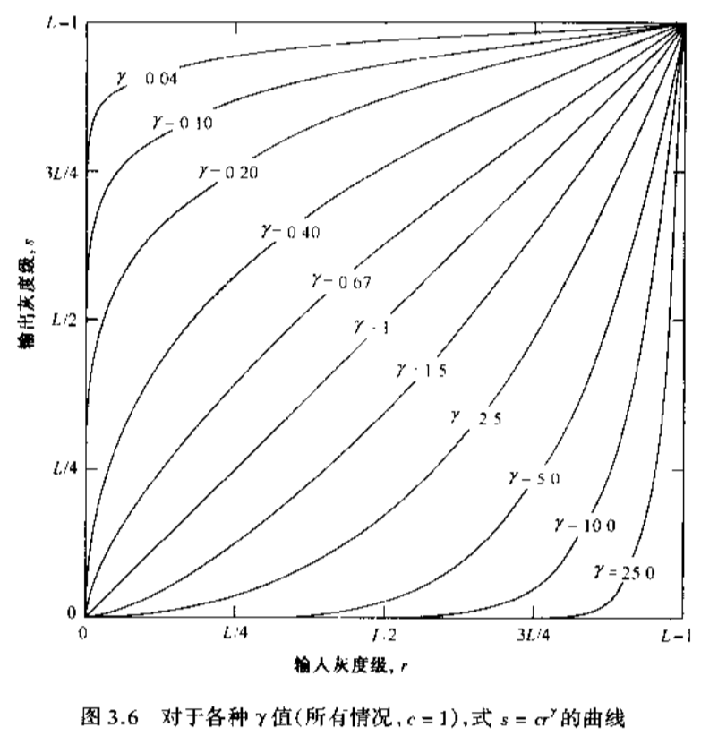

# 数字图像处理

[TOC]

### 1# 基本原理

-   图像取样和量化
    -   取样：每个长度单位获取该位置的值
    -   量化：令取样的值使用标尺给定的值
    -   取样和量化的结果是一个实际矩阵

-   分辨率
    -   空间分辨率
        -   单位长度内，能分辨的线对数
        -   或者说，把大小M*N，灰度为L级的数字图像称为空间分辨率为M\*N像素，灰度分辨率为L级的数字图像

    -   灰度级分辨率：通常为2的幂级数，该值越高，黑白关系越明显
    -   对比度：图像中最大亮度和最小亮度之比

-   图像的放大和缩小：放大可看作采样，缩小可看作欠采样

-   放大的两个步骤
    -   叠加网格：放大后的像素网格b叠加在原来的网格a上
    -   灰度赋值：给b的每个像素点赋值。有如下方式
        -   最近邻内插：b的像素值为最近的a的像素值
        -   双线性内插：使用邻近4个点的像素值，按照距离赋予权重
        -   立方内插：基于三次方程内插
        -   （越下，效果越好，算法量越大）

-   像素之间关系
    -   p的相邻像素
        -   (x+1,y), (x-1,y), (x,y+1), (x,y-1) 
        -   这个像素集称为p的4领域，写作N~4~(p)
    -   p的对角邻像素
        -   (x+1,y+1), (x-1,y+1), (x-1,y+1), (x-1,y-1) 
        -   这个像素集用N~D~(p)表示
    -   N~4~(p) 与 N~D~(p)合起来称为p的8领域，写作N~8~(p)
    -   邻接性：灰度值相同的区域
    -   连通性
    -   区域和边界
    -   距离变量
        -   欧氏距离
        -   城市街区距离D~4~ 
        -   棋盘距离D~8~ 

-   使用Matlab
    -   读取图像
        -   `imread('test.jpg')`：读取图片
        -   `size()`：查看图片矩阵大小
        -   `whos()`：查看图片信息
        -   `imfinfo('test.jpg')`：查看图片详细信息
    -   显示图像
        -   `imshow(img)`：显示图像、指定灰度范围
        -   `imshow(img, [100,200])`：显示图像的指定灰度范围
        -   `imshow(img, [])`：显示图像的整个动态范围
    -   类型转换
        -   `im2uint8` 
        -   `im2double` 
    -   图像处理
        -   `im2bw(img, 0.5)`：转二值图像，参数2为阈值
        -   `imresize(img, 2, 'nearest')` ：图像收缩。参数2为放大倍数，参数3为插值方式
    
-   例：任意区域的剪切

    ```matlab
    I = imread('lena.bmp');
    % 由c、r组成的点坐标围城一个多边形
    c = [122 172 200 170 121 94];
    r = [21 21 75 121 121 75];
    % BW是一个二维矩阵，只有0和1
    BW = roipoly(I, c, r);
    % 交互式选择roi，即图像界面
    % BW = roipoly(I);
    
    figure; imshow(BW);
    figure; imshow(I.*uint8(BW));
    ```


### 2# 亮度变换与空间滤波

##### 基本灰度变换

-   灰度级变换s=T(r)

    

    -   例：对比度增强的灰度级变换

        -   在极限情况下，产生二值图像，在m左侧的图像变暗，m右侧的图像变亮

        

-   常用灰度级变换

    -   图像反转
    
    -   对数变换
    
    -   幂次变换（伽马变换）
    
    -   灰度切割：增强某一亮度特征
    
    -   位图切割：设每个像素由n比特表示，则高比特位最清晰
    
        ```matlab
        % 位图切割：显示8个位平面图像
        A = imread('lena.bmp');
        subplot(3,3,1);
        imshow(A);title('原始图像');
        for i=8:-1:1
           A_bitplane = logical(bitget(A,i));
           subplot(3, 3, 9-i+1);
           imshow(A_bitplane);
           title(['位平面 ' num2str(i)]);
        end
        ```
    
    -   位图移位
    
        ```matlab
        % 减少位深
        B=bitshift(A,-2);
        B=bitshift(B,2);
        figure;
        subplot(1,2,1);imshow(A);
        title('原图像');
        subplot(1,2,2);imshow(B);
        title('位深6bit');
        ```
    
    


##### 直方图处理

-   h(r~k~) = n~k~

    -   r~k~是第k级的灰度
    -   n~k~是图像中灰度级为r~k~的像素个数

-   查看图像直方图

    ```matlab
    target = imread('images/rice.tif');
    
    subplot(2,2,1);imshow(target);title('原图')
    subplot(2,2,2);imhist(target);title('原图')
    ```

-   图像直方图的对比

    

-   直方图均衡化

    -   能够自动确定变换函数，旨在生成有均匀直方图的输出图像

-   直方图匹配（规定化）

##### 空间滤波基础

-   使用`ImFilter()`实现

##### 平滑滤波器（均值滤波器、低通滤波器）

-   线性平滑滤波器：使用滤波掩模确定的邻域内像素的平均灰度值去代替图像每个像素点的值
-   统计排序滤波器：非线性
    -   基于图像滤波器包围的图像区域中像素的排序，然后由统计排序结果决定的值代替中心像素的值
    -   中值滤波器：使用邻域内灰度的中值代替该像素的值。适合去除椒盐噪声

##### 锐化空间滤波器

-   均值处理与积分相似，所以锐化处理可以使用微分来完成
-   基于二阶微分的图像增强：拉普拉斯算子


### 4# 频域处理

##### 傅里叶变换和频率域的介绍

-   令`F(u,v)`为图像函数`f(x,y)`的DFT
    -   每个`F(u,v)`项包含了被指数项修正的`f(x,y)`的所有值，因此一般不可能建立图像特定分量和其变换之间的直接关系
    -   低频对应着图像的慢变化分量，如平滑的墙壁
    -   高频则对应着图像中变化越来越快的灰度级
    -   较高频率是物体的边缘和灰度级的突发改变（如：噪声）标志的图像成分
    
-   在频率域中的滤波
    -   步骤
        -   用(-1)^x+y^ 乘以输入图像来进行中心变换后，计算图像的DFT：`F(u,v)` 
        -   用滤波器函数`H(u,v)`乘以`F(u,v)`后，计算其IDFT并获得结果中的实部
        -   使用(-1)^x+y^乘以实部即可
    -   `H(u,v)`滤波器传递函数：抑制某些频率

-   空域滤波器和频域滤波器

    -   对应关系：空域卷积，频域相乘

    -   由空域滤波器得到频域滤波器

        ```matlab
        f = im2double(imread('lena.bmp'));
        [M,N] = size(f);
        h = fspecial('gaussian',7,3);
        % freq2能够实现去中心化
        H = ifftshift(freqz2(h,N,M));
        F = fft2(f);
        G = F.*H;
        g = real(ifft2(G));
        imshow(g);
        ```

    -   为什么不直接使用卷积：同样是对每个像素进行处理，当算子越大，卷积的时间复杂度越高

    -   更多算子

        -   高斯：中间高频
        -   sobel：反映图像垂直方向的变化
        -   拉普拉斯：中间为低频，四周为高频
    
-   图形幅度谱、相位谱与图像关系


##### 频域滤波器

-   理想低频滤波器ILPF

    ```matlab
    % ...
    [M,N] = size(f)
    [U,V] = dftuv(M,N);
    D = hypot(U,V);
    D0 = 30;
    % 大于D0则为0,小于则为1
    H = (D0<=30);
    F = fft2(f);
    % ...
    ```

    -   有振铃现象

-   巴特沃思滤波器BLPF

    -   低阶的BLPF处理后没有如ILPF出现明显的振铃现象

-   高斯低通滤波器GLPF

    -   无振铃现象

-   理想高通滤波器IHPF

    -   同样有振铃现象

-   BHPF、GHPF

-   高频加强滤波器

-   带通/带陷滤波器：某一部分频率通过/不通过


### 5# 图像复原

##### 图像退化/复原过程

-   图像退化：图像在形成、记录、传输过程中，由于系统和技术不完善导致的图像质量下降（如拍照）
    -   可记为：`g(x,y) = h(x,y)*f(x,y)（卷积） + η(x+y)`
        -   `h(x+y)`为退化函数
        -   `η(x+y)`为噪声
-   图像复原：利用退化过程的先验知识，通过退化的逆过程，使已退化的图像恢复本来的面目
    -   使用频域描述以减低计算复杂度，则退化图像记为`G(u,v) =  H(u,v)F(u,v) + N(u,v)`
    -   求得原图像F(u,v)则需要使用逆滤波器$\frac{1}{H(u,v)}$ 
    -   噪声的处理十分棘手，可以通过为逆滤波器增加一个低通滤波器优化

##### 噪声

-   噪声模型：噪声的概率密度函数（PDF）

    -   白噪声：在整个频域都会出现的噪声
    -   瑞利噪声：相比高斯噪声，均值某一侧较垂直
    -   伽马噪声
    -   指数分布噪声
    -   均匀分布噪声：等概率出现
    -   脉冲噪声（椒盐噪声）

-   添加噪声

    ```matlab
    % 参数3、4：均值，方差
    g = imnoise(f, 'gaussian', 0, 0.1)
    ```

-   噪声抑制（图像只受噪声影响下）

-   噪声模型的估计

    -   选择图像灰度基本恒定的区域（降低难度啊）
    -   通过计算推导噪声的PDF

    ```matlab
    % 获取噪声的直方图并进行估计
    
    f = imread('lena.bmp');
    % 添加噪声
    % fn = imnoise(f, 'gaussian', 0, 0.1) 
    [B,c,r] = roipoly(fn);
    figure; imshow(B);	% B的区域只有0和1，roi区为1
    N = fn.*uint8(B);
    figure; imshow(N)
    H = imhist(fn(B))	%只求值为1区域的直方图
    figure; bar(H)		%得到直方图
    ```

-   仅有噪声下的复原方法

    -   几何/算术均值滤波器
        -   几何均值滤波器的平滑效果与算术均值滤波器相当，但倾向于损失较少的图像细节
        -   算术和几何适合处理高斯或均匀等随机噪声
    
    -   调和均值滤波器
        -   对盐噪声较有效，对椒噪声效果差
    
    -   反调和均值滤波器：Q为该滤波器的阶数
        -   Q=0时等同于算术均值滤波器
        -   Q=-1时等同于调和均值滤波器
        -   Q<0时适合消除盐噪声
        -   Q>0时适合消除椒噪声
        -   调和与反调和更适于处理脉冲噪声,但必须知道是暗噪声还是亮噪声,以便选择Q值符号
    -   统计排序滤波器
        -   中值滤波器：处理椒盐噪声的最佳方案。多次处理效果更好，但图像也会更加模糊
        -   最大值滤波器：取最大值。可以去除椒噪声，但是也会从黑色物体边缘移走一些黑色像素
        -   最小值滤波器：取最小值。可以去除盐噪声，但是也会从亮色物体边缘移走一些白色像素
        -   中点滤波器：适合处理高斯和均匀随机分布这类噪声
        -   修正的α均值滤波器：除了处理椒盐噪声，对均匀噪声效果也好

    ```matlab
    f = imread()
    g = imnoise(f, 'gaussian', 0, 0.001)
    f_denoise = spfilt(g, 'gmean', 3, 3)
    ```

    -   自适应滤波器：利用由m*n矩形窗口定义的区域内图像的统计特征进行处理
    
    ```matlab
    f_denoise = adpmedian(g, 7);
    ```
    
    -   带阻滤波器：用于去除周期噪声


### 6# 彩色图像处理

##### 三维坐标系的色彩模型

-   RGB模型
    -   （全）真彩色：以24位表示的RGB彩色图像，即`#ffffff`为白色
    
    -   获取RGB彩色空间的切面
    
    -   获取色彩单独通道
    
        ```matlab
        I=imread('tommy.bmp');
        Ir=I(:,:,1);
        Ig=I(:,:,2);
        Ib=I(:,:,3);
        ```
    
-   HSV模型：色调、饱和度、数值
    
    -   RGB转HSV
    
        ```c
        // 伪代码
        max=max(R,G,B)；
        min=min(R,G,B)；
        V=max(R,G,B)；
        S=(max-min)/max；
        if (R = max) H =(G-B)/(max-min)* 60；
        if (G = max) H = 120+(B-R)/(max-min)* 60
        if (B = max) H = 240 +(R-G)/(max-min)* 60；
        if (H < 0) H = H + 360； 
        ```
    


### 7# 图像压缩

-   图像压缩的必要性
    -   图像大
    -   图像存在冗余：像素间邻域存在冗余
-   压缩的分类：按照保真度、按照图像类型
-   保真度准则：均方根误差、均方信噪比
-   压缩效率指标：
    -   图像信息熵
    -   编码冗余度与编码效率


### 8# 形态学图像处理

### 9# 图像分割

