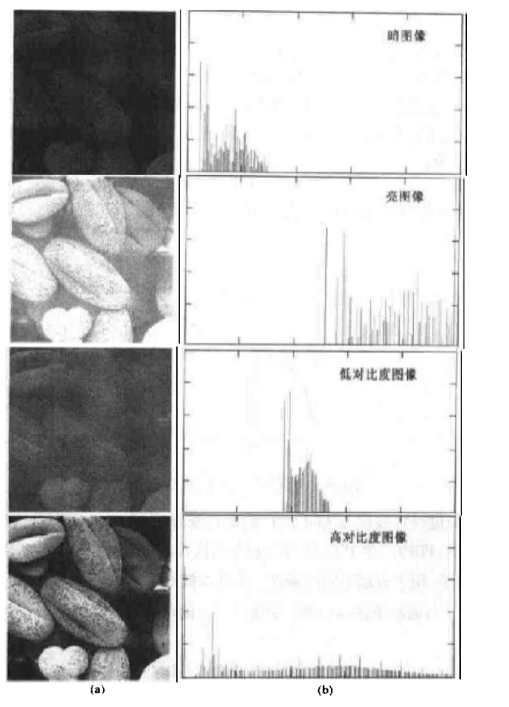

# 数字图像处理

[TOC]

### 1# 基本原理

-   图像取样和量化
    -   取样：每个长度单位获取该位置的值
    -   量化：令取样的值使用标尺给定的值
    -   取样和量化的结果是一个实际矩阵

-   分辨率
    -   空间分辨率
        -   单位长度内，能分辨的线对数
        -   或者说，把大小M*N，灰度为L级的数字图像称为空间分辨率为M\*N像素，灰度分辨率为L级的数字图像

    -   灰度级分辨率：通常为2的幂级数，该值越高，黑白关系越明显
    -   对比度：图像中最大亮度和最小亮度之比

-   图像的放大和缩小：放大可看作采样，缩小可看作欠采样

-   放大的两个步骤
    -   叠加网格：放大后的像素网格b叠加在原来的网格a上
    -   灰度赋值：给b的每个像素点赋值。有如下方式
        -   最近邻内插：b的像素值为最近的a的像素值
        -   双线性内插：使用邻近4个点的像素值，按照距离赋予权重
        -   立方内插：基于三次方程内插
        -   （越下，效果越好，算法量越大）

-   像素之间关系
    -   p的相邻像素
        -   (x+1,y), (x-1,y), (x,y+1), (x,y-1) 
        -   这个像素集称为p的4领域，写作N~4~(p)
    -   p的对角邻像素
        -   (x+1,y+1), (x-1,y+1), (x-1,y+1), (x-1,y-1) 
        -   这个像素集用N~D~(p)表示
    -   N~4~(p) 与 N~D~(p)合起来称为p的8领域，写作N~8~(p)
    -   邻接性：灰度值相同的区域
    -   连通性
    -   区域和边界
    -   距离变量
        -   欧氏距离
        -   城市街区距离D~4~ 
        -   棋盘距离D~8~ 

-   使用Matlab
    -   读取图像
        -   `imread('test.jpg')`：读取图片
        -   `size()`：查看图片矩阵大小
        -   `whos()`：查看图片信息
        -   `imfinfo('test.jpg')`：查看图片详细信息
    -   显示图像
        -   `imshow(img)`：显示图像、指定灰度范围
        -   `imshow(img, [100,200])`：显示图像的指定灰度范围
        -   `imshow(img, [])`：显示图像的整个动态范围
    -   类型转换
        -   `im2uint8` 
        -   `im2double` 
    -   图像处理
        -   `im2bw(img, 0.5)`：转二值图像，参数2为阈值
        -   `imresize(img, 2, 'nearest')` ：图像收缩。参数2为放大倍数，参数3为插值方式
    
-   例：任意区域的剪切

    ```matlab
    I = imread('lena.bmp');
    % 由c、r组成的点坐标围城一个多边形
    c = [122 172 200 170 121 94];
    r = [21 21 75 121 121 75];
    % BW是一个二维矩阵，只有0和1
    BW = roipoly(I, c, r);
    % 交互式选择roi，即图像界面
    % BW = roipoly(I);
    
    figure; imshow(BW);
    figure; imshow(I.*uint8(BW));
    ```


### 2# 亮度变换与空间滤波

##### 基本灰度变换

-   灰度级变换s=T(r)

    

    -   例：对比度增强的灰度级变换

        -   在极限情况下，产生二值图像，在m左侧的图像变暗，m右侧的图像变亮

        

-   常用灰度级变换

    -   图像反转
    -   对数变换
    -   幂次变换（伽马变换）
    -   分段线性变换函数
        -   灰度切割：增强某一亮度特征
        -   位图切割：设每个像素由n比特表示，则高比特位最清晰


##### 直方图处理

-   h(r~k~) = n~k~

    -   r~k~是第k级的灰度
    -   n~k~是图像中灰度级为r~k~的像素个数

-   图像直方图的对比

    

-   直方图均衡化

    -   能够自动确定变换函数，旨在生成有均匀直方图的输出图像

-   直方图匹配（规定化）

##### 空间滤波基础

##### 平滑滤波器（均值滤波器、低通滤波器）

-   线性平滑滤波器：使用滤波掩模确定的邻域内像素的平均灰度值去代替图像每个像素点的值
-   统计排序滤波器：非线性
    -   基于图像滤波器包围的图像区域中像素的排序，然后由统计排序结果决定的值代替中心像素的值
    -   中值滤波器：使用邻域内灰度的中值代替该像素的值。适合去除椒盐噪声

##### 锐化空间滤波器

-   均值处理与积分相似，所以锐化处理可以使用微分来完成
-   基于二阶微分的图像增强：拉普拉斯算子

### 4# 频域处理

##### 傅里叶变换和频率域的介绍

-   令`F(u,v)`为图像函数`f(x,y)`的DFT
    -   每个`F(u,v)`项包含了被指数项修正的`f(x,y)`的所有值，因此一般不可能建立图像特定分量和其变换之间的直接关系
    -   低频对应着图像的慢变化分量，如平滑的墙壁
    -   高频则对应着图像中变化越来越快的灰度级
    -   较高频率是物体的边缘和灰度级的突发改变（如：噪声）标志的图像成分
-   在频率域中的滤波
    -   步骤
        -   用(-1)^x+y^ 乘以输入图像来进行中心变换后，计算图像的DFT：`F(u,v)` 
        -   用滤波器函数`H(u,v)`乘以`F(u,v)`后，计算其IDFT并获得结果中的实部
        -   使用(-1)x+y乘以实部即可
    -   `H(u,v)`滤波器传递函数：抑制某些频率
-   

### 5# 图像复原

### 6# 彩色图像处理

### 7# 图像压缩

### 8# 形态学图像处理

### 9# 图像分割

