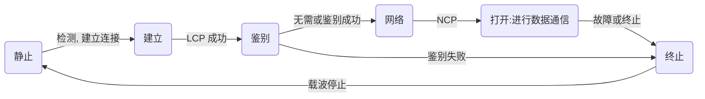

[TOC]

# 计算机网络

> 4节实验课、仿真软件：Packet Tracer 或 ENSP
> 平时成绩60% 期末成绩40%


### 计算机网络概述 #1

##### 因特网

- 网络、互连网、因特网
  - 网络：由若干结点（Node）和连接这些结点的链路组成（Link）
  - 互连网(internet)：多个网络互联起来
  - 互联网、因特网(Internet)：世界上最大的互连网络
  - 主机：每台连接网络的设备
- 因特网发展3个阶段
  - 从单个ARPANET向互联网发展
  - 逐步建成三级结构的因特网
  - 逐步形成了多层次ISP结构的因特网
- ISP：因特网服务提供者（电信、移动、联通等）
- 基于ISP的三层结构的因特网
  - 第一层：因特网主干网。覆盖国际性区域范围，拥有高速链路和交换设备-ISP之间直接参与互联
  - 第二层：第一层ISP的客户，有大公司或者ISP。具有区域性或国家性覆盖规模
  - 第三层：本地ISP。第二层ISP的用户。校园网、小区等是这层的用户
- 因特网的标准化工作：因特网协会ISOC
- 因特网组成

##### 网络

- 在cmd中使用`tracert+ `网站可以进行路径追踪，检索一路上所经过的结点
- 计算机网络定义：一些互相连接的、**自治的计算机**的集合
- 计算机网络功能
  - 数据通信
  - 资源共享：软件、硬件、数据、通信信道
  - 负载均衡与分布式处理：有空来帮忙
  - 提高可靠性：得到后备
  - 综合信息服务

##### 计算机网络分类

- 按照拓扑结构分类
  - 总线型
    - 结构简单、增减结点方便、节省线路，节点故障不殃及系统
    - 重负载时通信效率不高，任意一处出现故障，则全网瘫痪，且不易排查
    - 节点不宜过多
    - 最著名：共享介质式以太网Ethernet
  - 星形
    - 结构简单、便于网络的集中控制和管理，节点故障不殃及系统
    - 通信线路专用，所以成本高、中央设备对故障敏感
  - 环型
    - 环中信号单行传输、结构简单、传输速率高
    - 任意节点出现故障都会造成网络瘫痪、排查难，节点加入难
  - 树型
    - 结构简单、扩展灵活
    - 资源共享能力差、对根节点依赖性大
  - 网状型
    - 每个结点至少有两条路径与其他结点相连，可靠性高
    - 控制复杂、线路成本高、不易维护
  - ……
- 按照覆盖范围分类：个域网PAN》局域网LAN》城域网MAN》广域网WAN》Internet
  - 广域网通常采用网状拓扑结构
  - 局域网-广域网是通过路由器实现的
- 按交换技术分类
  - 电路交换
    - 电路建立-数据传输-电路释放
    - 通信时延小、有序传输、实时性强、控制简单
    - 建立连接时间长、使用效率低、灵活性差、没有任何差错控制措施
  - 报文交换：适合于突发性强的数据通信（已被分组交换取代）
    - 转发时延、要求设备有较大缓冲区
  - 分组交换
    - 发送方：构造分组、发送分组
    - 路由器：缓存分组、转发分组
    - 接收方：接收分组、还原报文
    - 无需建立连接、线路利用率高、简化存储管理、加速传输、无长度限制
    - 引起了转发时延、需传输额外信息量、存在失序、丢失、重复分组的问题、控制复杂
- 按传输介质分类：有线、无线
- 按使用者分类：公有、私有
- 通信子网的主要组成：网络节点和通信链路
  - WAN中通信子网主要由传输线路和交换单元（路由器）组成
  - 网络节点
    - 转换和交换信息的转接节点
    - 访问节点
- 互联网接入
  - ADSL方式接入
  - 局域网接入（小区宽带接入）：以太网技术
  - 有线电视接入等
- 调制解调器作用：将数字信号与模拟信号相互转换

##### 网络性能指标

- 速率

  - 比特：数据量单位 1bit=8byte
  - 速率称为比特率，表示每秒传送比特数
  - 对于高速网络链路，提升的仅仅是数据发送速率，而非比特在链路上的传播速率（减小了数据的发送时延）
- 带宽：信号速率理论上限


- 吞吐量：信道速率实际值
- 时延

  - 时延=（处理+传播+发送+排队）时延
  - 取决于传输信道的介质材料和传输距离
- 时延带宽机：信道装满bit
- 往返时间RTT（Route Trip Time）：信号在信道上往返一次的时间
- 利用率

  - 吞吐量 除以 带宽
  - 并非越高越好，越高会引起越大的延迟
- 丢包率：丢包 除以 总丢包数


[TOC]

### 网络体系架构与网络协议 #2

##### 网络体系结构

- 网络体系结构三个重要概念

  - 协议：为网络数据交换而定制一种通信规则，能够保证通信系统的正常和有序运行
    - 语义：解释比特流每一部分的意义(what)
    - 语法：用户数据与控制信息的结构与格式，以及数据出现的顺序的意义(how)
    - 时序：事件实现顺序的详细说明(when)
  - 层次：将总体要实现的功能分配在不同层次中，每个层次要完成的服务及服务要求都有明确规定
    - 不同系统的对等层之间的通信有明确的通信规定
    - 高层不需要知道底层服务具体实现方法
  - 接口：同一节点内相邻层之间交换信息的连接点。低层向高层通过接口提供服务

- 网络体系结构：网络层次模型与各层协议的集合称为网络体系结构
  - 网络协议按层次来组织
  - 对计算机网络应该实现的功能进行了精确定义

- 网络体系结构的研究方法优点：各层相互独立、灵活性好、易于实现和维护、有助于促进标准化

##### 参考模型

- OSI体系结构（被放弃）
  - 层与层之间的联系通过接口进行
- TCP/IP体系结构，共四层
  - 取消了OSI体系的表示层和会话层，合并为应用层
  - 将数据链路层和物理层统一为网络接口层（网际层）
  - 路由器一般只包含网络接口层和网际层
- 原理体系结构：将TCP/IP的网际层改为物理层和数据链路层，便于教学
  - 注意：体系结构不关心协议的内部实现细节
- 分层

  - 物理层：解决使用何种信号来传输比特的问题（比特流传输），无头部或尾部信息。无差错控制。
    - 数据单元bit
    - 从介质、物理接口、表示比特0和1的信号获取信息
  - 数据链路层：解决分组在一个网络上传输的问题（**相邻节点**通信、无线链路的可靠数据传输），既有头部，也有尾部。
    - 数据单元frame
    - 标识网络中的各主机
    - 从比特流中区分出地址
    - 协调各主机争用总线
    - 保证数据的正确顺序、无差错和完整性
  - 网络层：解决分组在多个网络上传输的问题（路由选择），只有头部。
    - 协议数据单元为packet（分组）
    - 标识网络及网络中各主机
    - 解决路由器转发分组
    - TCP/IP参考模型的网络层提供的是无连接不可靠的数据报服务
  - 运输层：解决进程之间基于网络的通信问题（**端到端**通信、可靠数据传输），只有头部。协议有TCP和UDP。数据单元segment
    - 解决进程之间基于网络的通信问题
    - 出现错误时（如：误码）解决问题
  - （OSI）会话层：解决进程之间进行会话问题
  - （OSI）表示层：解决通信双方交换信息的表示问题（数据格式转换）
  - 应用层：解决通过应用进程的交互来实现特点网络应用的问题，只有头部
    - 完成特定的网络应用
- 数据传递过程

  - 发送端
    1. 应用层构建一个HTTP请求报文
    2. 运输层给HTTP请求报文添加一个（TCP）首部
    3. 网络层给报文段添加一个IP首部
    4. 数据链路层给报文添加首部和尾部，使得整个数据称为帧
    5. 物理层将帧看作是比特流
    6. 将比特流变换成相应的信号发送到传输媒体，并添加能够让目的主机接受帧的准备的前导码
  - 路由器
    1. 将物理层信号重新转换知道读取到网络层，解析IP报的首部，获取目的网络地址，查找自身的路由表，确定转发端口
    2. 再恢复为比特流，并添加前导码
  - 服务器
    1. 解析为HTTP请求报文并解析，然后层层封装并返回数据
- 部分术语
  - 实体
    - 任何可发送或接收信息的硬件和软件进程
    - 对等实体：收发双方相同层次中的实体
  - 协议
    - 控制两个对等实体进行逻辑通信的规则的集合
    - 并不存在，只是方便研究
  - 服务
  - 在协议控制下，两个对等实体的逻辑通信使得本层能够向上一层提供服务
    - 要实现本层协议，还需使用下面一层所提供的服务
    - 协议是水平的，而服务是垂直的
  - 下层协议对上面的实体是透明的：实体能够看见相邻下层所提供的服务，但不知道实现该服务的具体协议
    - 服务访问点：在同一系统中相邻两层的实体交换信息的逻辑接口，用于区分不同的服务类型
    - 服务原语：上层使用下层所提供的服务必须通过下层交换一些命令，这些命令称为服务原语
    - 协议数据单元PDU
    - 服务数据单元SDU
    - 多个SDU可以合成一个PDU，一个SDU也可以划分为多个PDU

##### 网络标准化

> 是指对主机间数据传输的效率和可靠性所提供的保证机制

- 两种服务对通信协议的复杂性和传输的可靠性有很大的影响。在网络数据传输的各层都会涉及面向连接与无连接服务的问题
- 面向连接服务
  - 过程：连接建立、连接维护、释放连接
  - 该服务在数据传输的过程中，各分组可以不携带目的结点的地址
  - 该服务的传输连接类似一个通信管道，发送者在一端放入数据，接收者从另一端取出数据
  - 收发数据顺序不变，传输可靠性好，但是协议复杂，通信效率不高
    - 适用于在一定周期内向同一目的地发送许多报文的情况
- 无连接服务
  - 每个分组都携带完整的目的结点地址，各分组在系统中是独立连接的，不需经过连接建立、连接维护和释放连接三个过程
  - 目的结点接收的数据分组可能出现乱序、重复、丢失的现象
  - 可靠性不好，但是协议相对简单，通行效率高
    - 适用于传送少量的报文
- 网络标准化
  - 电信领域：国际电信联盟ITU...
  - 国际领域：国际标准化组织ISO、电气电子工程师协会IEEE
  - Internet领域：因特网活动委员会IAB、万维网联盟W3C

[TOC]

### 网络传输、设备与企业网络架构 #3

##### 常见企业网络架构

- 接入层：终端设备接入
- 汇聚层：数据流汇聚，数据管理
- 核心层：连接企业各个区域，提供高速数据转发
- 数据中心、DMZ区域：隔离区域（可被外部客户访问）、边缘区域

##### 传输媒介

- 双绞线：成本低，双绞以屏蔽磁场
  - 3类双绞线：电话线，绞合较松，带宽较低
  - 5类双绞线：网线，绞合紧，带宽较高
  - 非屏蔽双绞线UTP
  - 屏蔽双绞线STP
- 同轴电缆：有线电视系统的本地线路，使用铜芯进行信号传输，带宽高，成本低
  - 有线电视线
- 光纤：带宽高，衰减小，不受电磁干扰，质量轻，安全性好
  - 单模光纤、多模光纤
- 无线介质

##### 传输方式

- 串行（单行）传输与并行传输
- 同步传输与异步传输
  - 同步：每一时刻都有数据需要传输。为了知道何时开启读取下一段字节，需要通过时钟来确定
  - 异步：每段字节的开始和结束都会有额外的比特，意味着字节的开始与结束。字节内的比特仍是同步的
- 单工、半双工、全双工
  - 单工：单向
  - 半双工：双向，但不能同时
  - 全双工：双向，可同时

##### 编码与调制

- 消息-数据-信号=基带信号
- 编码-数字信道
  - 码元：代表不同离散数值的基本波形
  - 不归零码：正电平、负电平表示01
    - 存在同步问题（判断码元数量时）
  - 归零编码：在不归零码的基础上，每个码元的后半段会归零
    - 自同步、编码效率低
  - 曼切斯特编码
    - 传统以太网所使用，10Mb/s
    - 通过跳变表示时钟和数据
    - 上跳为0，下跳为1（也有不同定义）
  - 差分曼切斯特编码
    - 跳变方向与前一位不同表示1，相同表示0（一直在跳变）
- 调制-模拟信道
  - 调幅AM：1有载波、0无载波
  - 调频FM：1高频、0低频
  - 调相PM：相位正反
  - 一个码元表示多个比特：混合调制、正交振幅调制QAM、格雷码

##### 信道的极限容量

- 失真的因素：码元传输速率、信号传输距离、噪声干扰、传输媒体质量

- 奈氏准则：为了避免码间串扰，码元传输效率有上限（理想条件下）

  - 码元传输速率又称为波特率，与比特率有一定关系
  - 理想*低通*信道最高码元传输速率 2W Baud，单位（码元/s）
  - 理想*带通*信道的最高码元传输速率 W Baud，单位（码元/s）
    - W：信道带宽（Hz）
  - 影响因素：调制速度

- 香农公式：带宽受限且有高斯白噪声干扰的信道的极限信息传输速率
  - C=W$\times log_{2}(1+\frac{S}{N})$ 单位（bit/s）
  - C信道的极限信息传输速率
  - S信道内传送信号的平均功率
  - N信道内的高斯噪声功率
  - S/N信噪比，单位为分贝dB。信噪比越高，信息的极限传输速率越高
    - 信噪比(dB) = 10*log~10~(S/N)
  - 波特率Baud：每秒钟有多少个码元变化
  
  ```
  例1 在无噪声情况下，某通信链路的带宽为3kHz，采用4个相位，每个相位具有4个振幅器的QAM调制技术，则该通信链路的最大数据传输速率是？
  ------
  (奈氏准则)最高码元传输速率=2*3k = 6k(Baud)=6k(码元/秒)
  波形数量：4*4 = 16
  每个码元可携带信息：log_2 16 = 4
  最大传输速率：6k*4 = 24k(码元/秒)
  ```

##### 网络设备

- 集线器（已被交换机取代）
  - 星形拓扑结构，范围为局域网内网
  - 作用：对信号整形放大
  - 主机共享同一冲突域
  - 工作层次：物理层
- 交换机
  - 星形拓扑结构，范围为局域网内网
  - 作用：网内路由选择
  - 因为自带存储器，所以不会冲突。隔离冲突域，但不隔离广播域（VLAN除外）
  - 工作层次：物理层、链路层（存在三层交换机，有网络层）
  - 使用MAC地址，网内定位目标，不适合大规模网络寻址。速度比路由器快（硬件优势）
    - 采用12个10Mbps端口的半双工以太网交换机互连局域网，每个站点可获得的平均带宽为10Mbps
  - 核心交换机、汇聚交换机：连接企业网络各区域，处于核心位置的交换机称为核心交换机（按照重要性分类）
- 路由器
  - 作用：网间路由选择。协议转换-可以连接*异构网络*
  - 工作层次：物理层、链路层、网络层
  - 使用IP地址，全网定位目标，可以隔离广播域
  - 传输延迟最大，速度比交换机慢，这是软件劣势
- 防火墙（路由器能实现防火墙的功能，但性能远不如专用的）
  - 隔离内网和外网
- 无线接入点


[TOC]

### IP网络基础 #4

##### 数据传输过程及以太网帧结构

- 以太网上传输的数据帧
  - Ethernet II帧格式
    - 包含一个类型(Type)字段，标识以太帧处理完成之后将发送到哪个上层协议进行处理
    - 大多数的选择
  - IEEE 802.3格式：长度(Length)字段
- 以太网通过mac地址来唯一标识网络设备
- 局域网上的帧3种发送方式
  - 单播：从单一的源端发送到单一的目的端
  - 广播：从单一的源发送到共享以太网上的所有主机
  - 组播：比广播更加高效。是一个选择性的广播
- 以太网帧标识、校验
  - 实际传送的要比MAC帧多8个字节：前同步码、帧开始定界符
  - 通过前同步码和帧开始定界符来标识一个帧的开始和结束
  - CRC校验：通过求余生成，附在信息后边，一同发送。最后由接受发验证（详细见下）
- 封装成帧
  - 数据链路层给上层交付的协议数据单元添加帧头和帧尾使之成为帧
    - 帧头和帧尾中包含重要的控制信息
    - 两者作用之一是帧定界
  - 透明传输是指数据链路层对上层交付的传输数据没有任何限制，就好像数据链路层不存在一样
    - 面向字节的物理链路使用字节填充的方式实现透明传输
    - 面向比特的物理链路使用比特填充的方式实现透明传输
  - 为提高效率，应当使帧的数据部分长度尽可能大些
    - 每一种数据链路层协议都定义了帧的数据部分长度上限，即最大传输单元MTU

- MAC地址、IP地址、ARP协议

  - MAC地址：以太网的MAC子层所使用的地址。有48个比特
    - 一般固化在网卡（网络适配器）的EEPROM中。故称MAC地址为硬件地址、物理地址
    - MAC地址是对网络上各接口的唯一标识，而不是对网络上各设备的唯一标识（一个设备可以有几个网卡）
    - MAC地址格式、发送顺序、随机MAC地址
    - MAC地址不具备区分不同网络的功能
  - IP地址是TCP/IP体系结构网络层所使用的地址
  - ARP协议属于TCP/IP体系结构的网络层，用于通过IP地址获取设备的MAC地址

- 差错检测

  - 差错包括：随机差错、突发差错
  
  - 比特差错、误码率BER、差错检测码
  
  - CRC
    - CRC具有良好的检错能力，漏检率低
    - CRC方法：收发双方约定好一个生成多项式G(x)
    
    ```
    例1 发送端》
    G(x) = x^3 + x^2 + 1      可见最高次数n=3
    待发送信息为101001
    ------
    构造被除数》构造除数》构造余数》构造发送数据
    被除数 待发送信息后增加n个0：101001 000
    除数   多项式构成的比特串 ： 1101
    除法：101001000/1101 = 110101...1
    检查余数 若位数不足n，则前面补0：001
    构造发送数据 补余数       ：101001 001
    
    *除法中的减为异或运算（而不是真的减），只要位数一致即可运算，所以可以小数减大数
    *余数即校验码
    ```
    
    - 接收端处理方法大致相同，但是：①接收到的信息就是被除数 ②当接收端的余数不为0时则认为传输过程产生了误码
    
  - 检错码只能检测帧的传输过程是否出现差错，不能定位或修改错误


##### PPP协议

- 目前使用最广泛的点对点数据链路层协议，涉及了数据压缩
- PPP协议在点对点链路传输各种协议提供的标准方法：对各种协议数据报的封装方法、链路控制LCP、一套网络控制协议NCPs
- 帧格式：标志F、地址A、控制C、协议P、帧检验序列FCS
- 透明传输
  - 面向字节的异步链路采用插入转义字符的字节填充法
  - 面向比特的同步链路采用插入比特0的比特填充法：连续的5个1后，填充1个比特的0
  - 发送方：每发现...就立即填充/转换
  - 接收方：逆转换

- 工作状态



- 建立》鉴别 配置选项
  - 最大帧长
  - 鉴别协议
    - 无需鉴别、PAP、CHAP③
    - PAP认证是靠被认证方发送明文用户名和密码来完成的，而CHAP认证是由主认证方发起
    - PAP通过两次握手认证，而CHAP是3次握手。CHAP认证比PAP安全性高

[TOC]

##### IP协议

- 网络层概述
  - 主要任务：实现网络互连，进而实现数据包在各网络之间的传输
  - 重点：提供怎样的服务（可靠否）、网络寻址、路由选择
  - 因特网：使用TCP/IP协议栈
  - TCP/IP协议栈的网络层使用网际协议IP，是整个协议栈的核心协议，此层也被称为网际层
- IPv4数据报的首部格式：最大长度64kb
  - 版本：表示IP协议的版本（ipv4）.通信双方IP协议版本必须一致
  - 首部长度：表示IP数据报首部的长度
  - 可选字段：用来支持排错、测量及安全等措施
  - 填充字段：确保长度为4字节的整数倍，使用全0进行补充
  - 区分服务：用来获得更好的服务
  - 总长度：表示IP数据报的总长度（首部+数据载荷）
  - 标识、标志、片偏移：共同用于IP数据报分片
  - 生存时间TTL：防止IP数据报在网络中永久兜圈，TTL为0时抛弃
  - 协议：指明IPv4数据报的数据部分是何种协议数据单元（如ICMP）
  - 首部检验和：用来检测首部在传输过程中是否出现差错，称为因特网检验和
  - 源IP地址、目的IP地址

- IPv4地址概述
  - IPv4地址就是给因特网上的每一台主机（或路由器）的每一个接口分配一个在全世界范围内是唯一的32比特的标识符。IPv4采用点分十进制表示方法
  - 三个阶段：分类编址》划分子网》无分类编址


###### 分类编址的IPv4地址

- A、B、C类地址：由网络号和主机号组成。可分配给网络中的主机或路由器的各接口
  - A类地址网络号以`0`开头，有8位网络号，B类以`10`开头，有16位网络号，C类以`110`开头，有24位网络号（均指比特位）
  
  - 主机号全0、全1：网络地址，广播地址。不能分配给主机或路由器各接口
  
  - A类：最小网络号0，最大网络号127，但其作为本地环回测试地址，不指派。最大可指派的网络号为126
    - 最小本地环回测试地址127.0.0.1
    - 最大127.255.255.254
    
  - B类：最小网络号128，最大191
  
  - C类：最小192，最大223
  
    *地址分类与掩码无关*
  
  - 可指派网络数、每个网络可分配的IP地址数量
  
- D类地址（以1110开头）：多播地址、E类地址（以1111开头）：保留今后使用

- 为新增网络申请新的网络号坏处：需要等待、花费，增加路由表记录的数量、浪费原有网络号中剩余的IP地址

- 一般不使用的特殊IP地址

  - A类网络的0和127
  - 主机号全0：网络地址，主机号全1：广播地址
  - 255.255.255.255：受限广播，只在本网络上进行广播（路由器不转发）

###### 划分子网的IPv4地址

- 可以从主机号中借用一部分比特作为子网号，能够更有效地利用IP地址

- 默认的子网掩码是指在未划分的情况下使用的子网掩码

- 32比特的子网掩码可以表明分类的IP地址主机号部分被借用了几个比特作为子网号

  - 子网掩码使用连续的比特1来对应网络号和子网号，连续的比特0来对应主机号
  - 通过计算可以得到IPv4地址所在的网络地址

  ```
  例1：已知某个网络的地址为218.75.230.0，使用子网掩码255.255.255.128对其进行子网划分，请给出划分细节
  ------
  - C类网络地址》网络号`218.75.230`    主机号`.0`
  
    子网掩码》网络号部分`255.255.255` `.1` `0000000` 一个比特表示从主机号中借用一个比特作为子网号(网络号长度会一样)
  
  - 划分出的子网数量：2^1^=2
  
    每个子网可分配的地址数量：2^(8-1)^-2=126
  
  - 该网络可分配地址的数量为254：主机号为0是该网络的网络地址，主机号为255是该网络的广播地址。256-2=254
  ```

  ```
  例2：某主机的IP地址为180.80.77.55，子网掩码为255.255.252.0，如该主机向所在子网发送广播，则目的地址可以是
  
  - B类网络地址: `180.80` `.010011`(子网号) `01.00110111`
  - 子网掩码：`255.255` `.111111` `00.00000000` 。6个1表示从主机号中借用6个比特作为子网号
  - 主机所在子网的网络地址：`180.80` `.010011`(子网号) `00.00000000`，即180.80.76.0
  - 主机所在子网的广播地址：`180.80` `.010011`(子网号) `11.11111111` 即180.80.79.255
  ```

###### 无分类编址的IPv4地址

- 无分类编址的CIDR(Classless Inter-Domain Routing)：解决IP地址紧张的问题
  - 消除了传统A、B、C类以及划分子网的概念
  - 可以更加有效地分配IPv4的地址空间，在IPv6使用之前允许因特网的规模继续增长
  - 使用了VLSM的技术，将路由表中若干条路由汇聚为一条路由，减少了路由表的规模
  - 使用斜线记法（CIDR记法），在IPv4地址后面加上斜线“/”，在斜线后面写上网络前缀所占的比特数量
  
  ```
  例1：分析地址: 28.14.35.7/20
  
  - `128.14.0010` `0011.00000111`（前20位网络前缀+12比特主机号）
  - 最小地址：`128.14.0010` `0000.00000000`
  - 最大地址：`128.14.0010` `1111.11111111`
  - 地址数量：2^(32-20)^，最大主机数还需减2
  - 聚合C类网的数量：2^(24-20)^/2^8
  - 地址掩码：`11111111.11111111.1111` `0000.00000000` 20位+12位，即255.255.240.0
  ```
  
- 路由聚合（构造超网）
  - 路由器会通过路由聚合找到目的网络的IP地址最长的共同前缀并转发分组，这是最长前缀匹配，这样的路由更具体
  - 网络前缀越长，地址块越小，路由越具体

###### IPv4地址应用规划

- FLSM定长的子网掩码
  - 使用同一个子网掩码来划分子网(网络号-子网号-主机号)
  - 每个子网所分配的IP地址数量相同，造成IP地址的浪费
  - 子网划分的方式不灵活，只能划分出2^n^个子网（n=子网号比特数量）
- VLSM变长的子网掩码
  - CIDR使用了VLSM技术
  - 使用不同的子网掩码划分子网
  - 子网划分方式灵活，可以按需分配
  - 每个子网所分配的IP地址数量可以不同，尽可能减少对IP地址的浪费

[TOC]

##### VPN及NAT技术

- VPN(Virtual Private Network虚拟专用网)
  - VPN：利用公用的因特网作为本机构各专用网之间的通信载体
  - 内联网VPN：同一机构不同部门的内部网络所构成的VPN。有时一个机构需要外部机构参加进来，称为外联网VPN
  - VPN要保证数据安全性，会将原始的内部数据进行加密
  - 远程VPN：只要建立VPN隧道，员工在外部也能访问作用网络中的资源
- NAT(Network Address Tranlation网络地址转换)
  - NAT能使大量内部专用地址的专用网络用户共享少量外部全球地址来访问因特网上的主机和资源
  - NAT路由器掌握着全球IP地址，如果它具有n个全球P地址，则至多只有N个内网主机能够同时和因特网上的主机互动
  - 公有IP与私有IP
    - 公有IP：公网的计算机和Internet上的其他计算机可随意互相访问
    - 私有IP：在公网上是不能被识别的，必须通过NAT将内部IP地址转换成公网上可用的IP地址，从而实现内部IP地址与外部公网的通信
  - 静态NAT、动态NAT、NAPT
    - 静态NAT：内部网络的私有IP转换为公有IP地址，IP地址是一对一的
    - 动态NAT：IP地址是不确定的，随机的
    - NAPT：端口多路复用，内部网络的所有主机均可共享一个合法外部IP地址实现对因特网的访问（时分/频分/波分复用）
  - 利用运输层的端口和IP地址一起转换，这样，用一个全球IP地址就可以使多个拥有本地地址的主机同时和因特网上的主机进行通信，这种技术称为NAPT
  - NAT为外网屏蔽了内网主机的网络地址，提供了安全保护

##### ICMP

> Internet Control Message Protocol网际控制报文协议

- 有效地转发IP数据报和提高交付成功的机会，在网际层（物理层+数据链路层）使用，是IP协议的必需一部分。主机或路由器适用ICMP发送差错报告报文和询问报文
- ICMP把报文被封装在IP数据报中发送，消息的传输并非是可靠的，不具备差错纠正的功能（出错即抛弃，但可以报告差错）
- ICMP差错报文⑤
  - 终点不可达：路由器或主机不能交付数据报时（不知道怎么转发），丢弃IP数据报并向源主机发送ICMP差错报告报文
  - 源点抑制：当路由器或主机由于堵塞而丢弃数据报时，向源点发送源点抑制报文，使源点放慢发送速率
  - 时间超过：当路由器收到一个目的IP地址不是自己的IP数据报时，会将生存时间数据段减1.结果为0时丢弃该数据报并发送时间超过报文
  - 参数问题：首部中检验和字段发现首部在传输过程中出现误码，则丢弃该数据报并向源点发送参数问题报文
  - 改变路由（重定向）：路由器把改变路由报文发送给主机，并告知下次应将数据发送给其他更好的路由器
- ICMP询问报文②
  - 回送请求和回答
  - 时间戳请求和回答
- ICMP应用
  - 分组网间探测PING(Packet InterNet Grope)
  - 跟踪路由traceroute：测试从源到目的主机经过的路由

##### ARP

> Address Resolution Protocol地址解析协议

- 同一网络下，主机A知道主机B的IP地址但不知道MAC地址此时发送ARP请求
  - 局域网内询问这是谁的IP，直到主机B响应（广播）
  
  - B会给A发送ARP响应（将帧交付上层处理），以告知自己的MAC地址（单播）
  
  - 可以在几个路由器之间依次传播。源主机收到ARP响应后，将IP地址和MAC地址记录到ARP高速缓存表
  
  - 作用（概括）：用于建立IP地址到MAC地址的映射
  
- 源MAC地址（SMAC）和目的MAC地址（DMAC）

  - SMAC和DMAC只是路由器（或处理ARP的设备）的概念
    - 对于发送端来说，SMAC是发送设备，DMAC是全路径第一部遇到的路由器前
    - 对于接收端来说，SMAC是全路径最后一部遇到的路由器后，DMAC是接收设备
  - SIP、DIP不变，一直是发送设备和接收设备

##### 进程通信与端口号

- 通信子网就是把信息从一台主机传输到另一台主机。传输层不属于通信子网
- 运输层概述
  - 运输层协议又称端到端协议，为不同主机上的应用进程提供直接的通信服务是运输层的任务
    - 所谓的多播是不可能用TCP实现的。
  - 向高层用户屏蔽了下面网络核心的细节：如通信子网
  - 面向连接的TCP、无连接的UDP
  - 计算机通信的真正实体是位于通信两端主机中的进程，基础单元是套接字Socket
- 套接字Socket
  - 协议栈是根据套接字中记录的控制信息来工作的
    - 包括了计算机本身的ip及端口、通信对象的ip及端口、协议、进程标识符pid等
    - 可以通过`netstat -ano`命令查看套接字
    - ip为0.0.0.0时，表示不绑定IP地址
    - UDP协议中的套接字不绑定对方的地址和端口
    - 有多个本地ip是因为计算机上有多块网卡

  - 创建套接字时，首先分配一个套接字所需的内存空间，然后向其中写入初始状态
- 运输层端口号、复用、分用的概念
  - 运行在计算机上的进程用进程标识符pid来表示
  - 不同的操作系统会使用不同格式的pid，TCP/IP体系使用统一的进程标识：端口号（16bit）
    - 熟知端口号：0-1023这些端口号留给了TCP/IP体系中最重要的应用协议，如：HTTP服务器进程端口使用80
    - 登记端口号
    - 短暂端口号
  - 端口号只有本地有意义，即端口号只是为了标识本计算机应用层中的各进程
- 端对端通信
  - 连接：连接实际上是通信双方交换控制信息，在套接字中记录这些必要信息并准备数据收发的一连串操作
  - 控制信息
    - 客户端和服务器相互联络时交换的控制信息 / TCP头部记录的信息
    - 以太网和IP的控制信息
    - 控制协议栈的信息 / Socket中记录的信息
  - 负责保存控制信息的头部
      - 控制信息会被添加在客户端与服务器之间传递的网络包的开头
      - 在连接阶段，由于数据收发还没有开始，网络包中没有实际的数据，只有控制信息
      - 头部信息的控制位，如：SYN，表示连接


##### TCP

- 主要特点
  - 支持面向连接的传输服务
  - 支持全双工通信
  - 支持同时建立多个并发的TCP连接
  
- TCP报文段的首部格式

  - TCP采用面向字节流的方式，一个TCP报文段由首部和数据载荷构成
  - 固定首部（20字节）：源端口、目的端口、序号、确认号、数据偏移、保留、窗口、校验和、紧急指针
  - 扩展首部（40字节）：选项、填充
  - TCP是面向连接的协议，基于运输连接来传送TCP报文段

- TCP传输三个阶段

  - 建立TCP连接：三次握手

    

    - 同步位SYN、序号字段seq、确认位ACK、确认号字段ack

    1. 在TCP模块处创建表示连接控制信息的头部，通过TCP头部中的发送方和接收方端口号可以找到要连接的Socket。SYN置1

    2.  TCP模块将信息传递并委托IP模块进行发送。此时服务器处在监听状态
    
        ```
        SYN = 1, seq = x
        ```

    2. 服务器的IP模块将接收到的数据传递给TCP模块，服务器的TCP模块根据TCP头部控制信息找到端口号对应的Socket
    
    4. 服务器套接字写入相应信息，并将状态改为正在连接，然后返回响应。需如下设置表示已经收到相应的网络包且序号初始值未丢失。服务器进入同步与接收状态）

       ```
       SYN = 1, ACK = 1, seq = y, ack = x+1
       ```
    
    3. 如果客户端收到SYN为1则表示连接成功，这时会向套接字中写入服务器的IP地址、端口号等信息，并将状态改为连接完毕，然后返回响应
    
    3. 客户发进入连接已建立的状态。服务器接收后也进入连接已建立状态
    
       ```
       ACK = 1, seq = x+1, ack = y+1
       ```
    
  - TCP为了减少通信量，在确认信息中捎带下一个希望接收的报文的序号
  
- 收发数据阶段：已建立连接后

  - 将请求信息交给协议栈
      - 应用程序交给协议栈发送的数据量由应用程序决定，可能一次性传递所有数据，也可能逐行传递数据
      - 协议栈如果一收到数据就发送，可能会发送大量小包，导致网络效率下降。因此需要在数据积累到一定量时再发送（将数据存放在缓存区）
      - 协议栈还会对较大的数据进行拆分，以MSS单位进行拆分，拆分出来的每块数据会被放进单独的网络包中（比如上传一篇文章）
  - 网络包的数据积累量依据（由协议栈决定）
      - MTU：最大传输单元，该长度包括了TCP和IP头部，减去头部长度后称为MSS最大分度大小
      - 时间：不能一直等。协议栈内部有计时器，超时即发送
  - 使用ACK号确认网络包已收到
      - TCP具备确认对方是否成功收到网络包，以及对方没收到时进行重发的功能（TCP可靠传输）
      - 通过序列号得知是否遗漏了部分网络包。序列号并不是从1开始，而是一个随机值。这样可以防止通信过程被预测从而被发动网络攻击
      - 序列号的初始值会再TCP连接过程置入序号字段中
      - 如果没有遗漏，则接收方将目前为止接收到的数据长度加起来，计算出已接受多少字节，写入ACK号中并发送
      - 在得到对方确认前，发送过的包都会保存在发送缓存区中，如果对方没有返回某些包对应的ACK号，则重发
      - 因为TCP底层的集线器、路由器等都没有错误补偿机制，一旦检测到错误就直接丢弃相应的包，因此采用TCP机制保证可靠传输很有必要
      - 当发生网络中断或服务器宕机时，TCP在尝试几次重传无效后强制结束通信，并行上层报错
      - 控制位与序号字段的值
  
- 释放TCP连接：四次握手》终止位FIN

  1. 客户主动关闭，进入终止等待1，发送TCP连接释放

     ```
     FIN = 1, ACK = 1, seq = u, ack = v
     ```

  2. 服务器进入关闭等待，发送TCP普通确认。主机接收到时，进入终止等待2

     ```
     ACK = 1, seq = v, ack = u+1
     ```

  3. 此期间，TCP服务器如果还有数据要发送，客户仍要接收。传输完成后，服务器进入最后确认，发送TCP连接释放

     ```
     FIN = 1, ACK = 1, seq = w, ack = u+1
     ```

  4. 客户接收到后，发送TCP普通确认，并进入时间等待，等待2MSL（报文段寿命≈2min）后关闭

     ```
     ACK = 1, seq = u+1, ack = w+1
     ```

  5. 服务器接收到报文后进入关闭状态

     - seq与上次ack一致，ack是上次seq+1

- TCP的可靠传输

  - 面向连接的服务特性是保证可靠和顺序的提交，
    - 采用超时重传和肯定确认（捎带一个分组的序号）技术来实现可靠数据流的传送
    - 超时时间设置的根据是历史往返时间和最新获得的往返时间
  - TCP基于以字节为单位的滑动窗口来解决端到端的流量控制。TCP是全双工通信
    - 发送方的发送窗口是根据接收方的接收窗口设置的，但在同一时刻未必一样大
    - 首部中窗口window=2000时，表明可以接收2000字节数据
    - 窗口的重传分组数量最多可以等于滑动窗口的大小
  - TCP要求接收方必须有累计确认和捎带确认机制。可以减小传输开销

- TCP的流量控制

  - 流量控制使得发送速率不会过快（导致来不及接收）
  - 利用滑动窗口机制实现

##### UDP

- UDP是一种无连接、不可靠的传输层协议。在传输报文之前不需要在通信双方之间建立连接，因此减少了协议开销与传输延迟
- 如果UDP检测出在收到的分组出错，即丢弃该分组，既不确认，也不要求重传。此时，应用层承担可靠性方面的全部工作
- TCP和UDP分别拥有自己的端口号，可以存在于同一台主机
- UDP首部》比起TCP，首部开销更小
  - 伪首部：计算校验和（不属于UDP数据报部分）
  - 源端口、目的端口、长度（包括首部和数据部分的长度）、校验和
- 适用范围：视频播放类、简短的交互式应用、多播与广播应用

##### IPv6

- 与IPv4相比，优势：更大地址空间，使用更小的路由表更大的地址空间、增强了组播支持以及流支持、加入了对自动配置的支持、更高的安全性
- IPv6首部
- IPv6地址：零压缩法、兼容IPv4
- IPv4到IPv6的过度
  - 原则和目标：主机之间互通、避免设备之间依赖性、过度过程易理解易实现、可逐个、可随时更新
  - 主流技术：双栈策略、隧道技术

[TOC]

### 交换技术 #5

##### 经典局域网的交换技术|CSMA/CD

- 媒体接入控制MAC（media access control）
  - 静态划分信道：预先分配好信道。不灵活、利用率低，通常在无线网络中使用
  - 动态接入控制
    - （受控接入的一种）集中控制：主站以循环方式轮问有无数据发送
    - （受控接入的一种）分散控制：令牌沿环逐站传递，接收到令牌的站点才能发送数据，然后传递令牌
    - 受控接入已被淘汰
    - 随机接入：站点通过竞争发送数据，冲突时则不能发送
  
- CSMA/CD协议：多点接入》载波监听》碰撞检测
  - 以太网采用CSMA/CD协议解决多个站点共享总线的问题
  - CSMA/CD协议的工作原理
    - MA(Multiple Access)：多个主机在一条总线上，竞争使用总线
    - CS(Carrier Sense)：发送帧前先检查总线，若总线空闲96比特时间，则立即发送；若总线忙，则持续检测总线直到总线空闲96比特时间后再重新发送
    - CD(Collision Detection)：边发送边检测碰撞，若检测碰撞，则立即停止发送，退避一段随机时间后再重新发送
    - CSMACD的基本工作原理可以简单地概括为4点：先听后发，边发边听，冲突停止，随即延迟后重发
  - 使用CSMA/CD协议的以太网争用期（碰撞窗口）
    - 发送帧的主机最多经过以太网端到端往返传播时延2τ时长（最远两个端点之间往返的时间）就可检测到本次传输是否发生了碰撞。2τ称为争用期
    - 经过争用期这段时间还没有检测到碰撞，才能肯定这次发送没有碰撞
    - 以太网规定2τ的取值为512比特时间（发送512比特所耗费的时间）
  - 使用CSMA/CD协议的以太网的最小帧长和最大帧长
  
    最小帧长 = $\frac{最远距离d(m)*2}{电缆中的信号传播速度(m/s)}$ * 信道宽带（传输速率）
  
    - 争用期：$\frac{最远距离d(m)*2}{电缆中的信号传播速度(m/s)}$
  
    > 常用》
    >
    > 1Kbps = 10^3^bps   1Mbps = 10^6^bps   1Gbps = 10^9^bps  光速C= 3*10^8^ 
  
    - 以太网的最小帧长确保了主机可在帧发送完之前就检测到该帧发送过程中是否遭遇了碰撞。如果遇到碰撞，则立即停止发送帧的剩余部分，退避一段随机事件后重新发送
    - 为了防止主机长时间占用主线，以太网的帧不能太长
 ```
 例》在一个CSMA/CD协议的网络中，传输介质是一根电缆，传输速度为1Gbps。电缆中的信号传播速度为200 000km/s，若要求最远的两个站点之间的距离增加50m，则该网络最小数据帧长度应至少增加多少才能保证网络正常工作？
 ------
  - 介质距离增加50m，则检测冲突的最长时间增加：(50x2)/C
  
  - 这段时间可以传输的数据位数为：
  
    1Gbps x (50x2)/C = 10^9 bps x 100m/(2x10^8) m/s = 500bits
  
  - 因此至少增加500bits
 ```

  - CSMA/CD协议的退避算法
    - 随机退避时间 = 争用期 * 随机数。随机数从离散的整数集合中随机取出一个
    - 当重传次数达16次仍不成功，表明要此时发送数据的主机太多导致连续发生碰撞，应该丢弃该帧并向高层报告
  - 以太网的信道利用率S~max~ = 1/ (1+a) 
    - 其中 a = 以太网端到端距离τ / 以太网帧的长度T~0~

##### 交换机工作原理

- 交换机工作在数据链路层（也包括物理层）
- 交换机收到帧，在帧交换表中查找帧的目的MAC地址所对应的接口号，然后通过该接口转发帧
- 交换机是一种即插即用的设备，随着网络中各主机间的通信，交换机通过自学习（后项学习）算法建立帧交换表
- 交换机等价于网桥。网桥能够互联两个采用不同数据链路层协议、不同传输介质与不同传输速率的网络，但网络层协议要求相同
- 转发机制
  - 存储转发机制：交换机会继续CRC校验，耗时长
  - 直通交换
    - 只读取MAC地址后立即转发，不检错，耗时短
- 交换机学习和转发帧的流程
  1. 收到帧后进行学习（登记）。内容：帧的源MAC地址-接入交换机的接口号（学习发送来源的地址）
  2. 根据帧的目的MAC地址和交换机的帧交换表进行转发，有三种情况
     - 明确转发：交换机知道是哪个接口转发帧
     - 盲目转发：交换机不知道从哪个接口转发帧，只能将其通过除接入交换机的接口外的其他所有接口转发（泛洪）（发送非空、有连接的端口）
     - 明确丢弃：如发送端口和目的端口一致，则丢失
- 例：一台交换机的转发表是空的，此时接收到一个数据帧，该交换机对该数据帧的处理方式是：泛洪（广播）
- 注意：MAC地址FF代表着广播域
- 帧交换表中的每条记录有自己的有效时间，到期删除。原因：交换机的接口该接了其他主机、主机更换了网卡
- 注意：10个主机通过集线器相互连接，该集线器的带宽为100Mbps，则每台主机平均可以获得10Mbps带宽

##### 生成树协议STP

> 通过添加冗余链路提高以太网可靠性，但是也带来了负面效应：广播风暴、主机收到重复的广播帧、帧交换表震荡（漂移）

- 交换机生成树协议STP（Spanning Tree Protocol）：增加冗余链路的同时避免网络环路带来的问题
  - 无论交换机之间怎么连接，交换机都能够自动构建出一个逻辑上没有环路的网络，其逻辑拓扑结构是树型的
  - 自动堵塞链路以防止回路，当出现故障点时重新调整
  - 最终生成树型逻辑结构要确保连整个网络
    - 选择根桥（树的根节点），并广播其他节点找出靠拢的方向：先根据优先号（网桥ID），越小越前，再根据MAC地址，越小越前。根据优先顺序决定树的连接
    - 同一路径有两条链路：先根据优先级，越小越前，再根据端口编号。根端口决定同样路线的连接
    - 选举指定端口：选择最短的（每条链路二选一），当两条路线到根桥距离（路径开销）一样时。每条链路都要选择
    - 选举阻塞端口：要求不能是指定端口
  - 当首次交换机或网络的拓扑结构发生变化，交换机都会进行生成树的重新计算

##### 高速以太网

> 随着电子技术的发展，以太网的速率也不断提升

- 快速以太网的传输速率：100Mbit/s
- CSMA/CD协议对全双工方式工作的快速以太网是不起作用的
- 100BASE-T以太网
  - 参数a = τ / T~0~ = τ C/L
    - τ是以太网单程端到端的时延
    - T~0~是帧长与发送速率之比
- 吉比特以太网：仅半双工方式工作才需要碰撞检测
- 10吉比特以太网和更快的以太网
- 不同速度的高速以太网的物理层实现技术不同

##### 虚拟局域网VLAN

- 交换机工作在数据链路层和物理层
- 使用一个或多个交换机互连起来的以太网，其所有站点都属于一个广播域。随着交换式以太网规模扩大，广播域也相应的扩大
  - 广播域过大会带来弊端，如广播风暴
  - 网络中会频繁出现广播消息
- 分割广播域的方法：使用路由器隔离广播域（成本高），或使用虚拟局域网VLAN
- VLAN（Virtual Local Area Network）是一种将局域网内的设备划分与物理位置无关的逻辑组技术，这些逻辑组具有某些共同需求
  - 数据链路层的头部（交换机）加入标签，使得协议从以太网变成新的802.1Q协议

[TOC]

###  路由技术 #6

##### 路由协议概述

- 路由就是指导报文发送的路径信息，路由信息包括目标网络、路由权值、下一跳
- 网络层提供的两种服务
  - 虚电路服务：可靠通信应当由网络来保证
    - 连接的建立：必须建立网络层连接
    - 终点地址：仅在连接建立阶段使用，每个分组使用短的虚电路号
    - 分组的转发：属于同一条虚电路的分组均按照同一路由进行转发
    - 当结点出现故障时：所有通过出故障的结点的虚电路均不能工作
    - 分组的顺序：总是按发送顺序到达终点
    - 服务质量保证：可以将通信资源提前分配给每一个虚电路，容易实现
  - 数据报服务：可靠通信应当由用户主机来保证
    - 连接的建立：无需建立网络层连接
    - 终点地址：每个分组都有终点的完整地址
    - 分组的转发：每个分组可走不同的路由
    - 当结点出现故障时：出故障的结点可能会丢失分组，一些路由可能会发生变化
    - 分组的顺序：到达终点时不一定按发送顺序
    - 很难保证服务质量
  - TCP/IP体系结构的因特网的网际层提供的是简单灵活、无连接的、尽最大努力交付的数据报服务
- 路由选择协议概述
  - 静态路由选择
    - 由人工配置的网络路由、默认路由、特定主机路由、黑洞路由等都属于静态路由
    - 这种人工配置方式简单、开销小、但不能及时适应网络状态（流量、拓扑）的变化
    - 一般只在小规模网络中采用
  - 动态路由选择
    - 路由器通过路由选择协议自动获取路由信息
    - 比较复杂、开销较大、能较好地适应网络状态的变化
    - 使用与大规模网络
- 自治系统
- 路由选择协议：因特网采用分层次的路由选择协议
  - 内部网关协议IGP
    - 基于距离向量的协议：路由信息协议RIP、内部网关路由协议IGRP
    - 基于链路状态的协议：开放式最短路径优先OSPF、中间系统到中间系统IS-IS
  - 外部网关协议EGP
  - 路由器的基本结构：路由选择部分-路由表、分组转发部分-转发表
    - 路由表一般仅包含从目的网络到下一跳的映射
    - 路由表需要对网络拓扑变化的计算最优化
    - 转发表是从路由表得出的
    - 转发表的结构应当使其查找过程最优化
  - 路由器的转发表不可以和交换机一样通过后学习算法自动生成，因为路线不总是固定的
  - 等价路由
- 路由选择标准
  - 跳数、地理位置、带宽（大）、负载、通信成本、延时
  - 总开销 = 各标准 加权
- 静态路由配置及其可能产生的路由环路问题
  - 静态路由配置是指用户或网络管理员使用路由器相关命令给路由器人工配置路由表。这种人工配置简单、开销小、但不能及时适用网络状态的变化。一般只在小规模网络中使用
  - 使用静态路由配置可能导致产生路由环路的错误：配置错误、聚合了不存在的网络、网络故障
  - 路由条目的类型：直连路由、静态路由、动态路由
  - 特殊的静态路由条目
    - 默认路由（目的网络0.0.0.0，地址掩码0.0.0.0）
    - 特定主机路由（目的网络为特定主机的IP地址、地址掩码255.255.255.255）
    - 黑洞路由（下一跳为null0）
- 当一个IP分组直接交付时，要求发送方和目的站具有相同的是子网号

##### 路由算法

- 动态路由算法步骤
  - 测量：收集自己附件的网络拓扑信息
  - 更新：把收集到的信息通知其他路由器。收到信息时更新自己的数据库
  - 计算：将收集到的信息加入转发表
    - 一个路由器可以同时运行多种路由协议
- 最短路径算法

  - 树的最短路径算法SPF：构建网络拓扑图
  - 路径开销（加权算法）
  - Dijkstra算法（dfs+短的刷新）
- DV算法基于距离向量的：路由信息协议RIP
  
  - 仅和相邻路由器交换信息，但交换内容是自己的路由表
  - 周期性更新（30s）
  - RIP是内部网关协议IGP中最先得到广泛使用的协议之一
  - RIP要求自治系统AS内每一个路由器都要维护从它自己到AS内其他每一个网络的距离记录。这是一级距离，称为距离向量
  - RIP使用条数作为度量来衡量到达目的网络的距离
    - 路由器到直连网络的距离定义为1
    - 路由器到非直连网络的距离定义为所经过的路由器数+1
    - 允许一条路径最多只能包含15个路由器，距离等于16时相当于不可到达。因此，RIP只是用于小型互联网
  - RIP认为好的路由就是距离的路由，也就是所通过路由器数量最少的路由
  - 当到达同一目的网络有多条“距离相等”的路由时，可以进行等价负载均衡
  - RIP的基本工作过程
    - 路由器刚开始时，只知道自己到直连网络的距离为1
    - 仅与相邻路由器交换信息，交换自己的路由表，周期性交换
    - 若干次交换和更新后，每个路由器都知道到达本AS内各网络的最短路径和下一跳地址，称为收敛
  - RIP的路由条目的更新规则
    - 发现了新的网络》添加
    - 到达目的网络，相同下一跳（指的是同一来源的信息），最新消息（无论优势劣势）》更新
    - 到达目的网络，不同下一跳，新路由优势》更新
    - 到达目的网络，不同下一跳，新路由劣势》不更新
    - 到达目的网络，不同下一跳，等价负载均衡（两条路都能走）》添加
  - 路由环路或距离无穷计数：这是距离向量算法的一个固有问题，可以采用多种措施减少出现该问题的概率或减小该问题带来的危害
    - 无穷计数问题：坏消息传得慢（慢收敛导致路由接收了无效的路由信息）
    - 限制最大路径
    - 当路由表发生变化时就立即发送更新报文，而不是周期性发送
    - 让路由器记录收到某特定路由信息的接口，而不让同一路由信息再通过此接口反方向传送
- 链路状态路由算法LS
  - OSPF算法：开放（开源）最短路径优先算法
  
    - 和所有路由器交换信息，交换的是自己的邻居链路信息（链路状态、开销）
    - 每隔一个时间间隔从每个端口发送HELLO分组给相邻路由器，事件触发更新（拓扑变化）
    - 流程：发现邻接节点》测量线路开销》构造分组》发布链路状态分组》由链路状态数据库LSDB构建出拓扑
    
    - 不会产生路由环路、不限制网络规模、收敛速度快
    - 链路状态包括相邻的路由及链路的开销代价
    - 使用SPF算法得到拓扑

##### 外部网关协议EGP

> 例如：边界网关协议BGP

- 自治系统之间的路由选择必须考虑相关策略。BGP是力求寻找一条能够到达目的网络且比较好的路由（非最佳）
- BGP要求每个自治系统需要选择至少一个路由器作为该自治系统的"BGP发言人"
- BGP发言人除了运行BGP协议外，还必须运行自己所在自治系统所使用的内部网关协议IGP，例如OSPF或RIP


[TOC]

### 浏览器生成信息 #7

##### 生成HTTP信息

-   URL格式
-   HTTP协议：浏览器使用HTTP协议来访问Web服务器
    -   基本思路
        -   客户端向服务器发送请求消息，请求消息包括“对什么”和“进行什么操作”
        -   服务器解析请求消息、执行任务、返回响应消息。响应消息包括了状态码、头字段、网页数据等
    -   HTTP主要方法：GET、POST...
    -   请求信息的格式
        -   每条请求消息中只能有1个URL。所以浏览器解析HTML时遇到img标签会再请求一次

##### 委托协议栈发送信息

-   域名解析
    -   TCP/IP网络通过IP地址确定通信对象，所以访问服务器前，需要先通过DNS服务器查询IP地址
    -   把DNS客户端称发送请求消息的程序叫解析器，查询IP的操作称为域名解析
    -   解析器位于Socket库中，查询过程会委托给操作系统内部的协议栈来执行
-   收发数据的思路
    -   客户端与服务器先建立管道，其出入口称为套接字Socket。双方都需要先创建一个套接字然后才使用管道连接
    -   以上操作皆通过操作系统中的协议栈完成
    -   套接字
        -   同一台计算机上可能会存在多个套接字，计算机内部通过描述符来识别不同的套接字
        -   连接过程中，通信方使用端口号来识别套接字
-   

